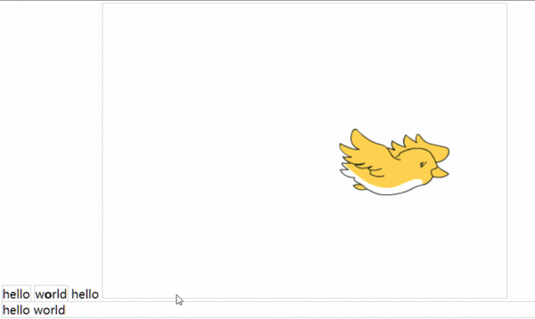

## 题外话

我认为基础是最重要的，要想要爬到山顶，你必须要做充足的准备，一味的攀登，最后只能看见一些表面的风景，一旦刮风下雨，就无功而返。

我说的什么意思呢？就是要注重基础，自己实践，不要觉得自己进度慢，要慢慢来。

那就开始正题吧！

## 文档流（normal flow）

要想了解什么是文档流，那就要知道流的概念。想象一下，什么是“流”？我们平常说的“水流”“流体”，我们就可以把像河流那样长长的东西作为流。


那这里所指的**文档流**指的是什么呢？由于这是显示在浏览器上面的，显示在电脑屏幕前的。如果我们将屏幕的两侧想象成河道，将屏幕的上面作为流的源头，将屏幕的底部作为流的结尾的话，那我们就抽象出来了文档流 ！


像水流，流动的是水，电磁流流动的是电磁。那文档流流动的又是什么呢？那就是元素！可以将屏幕中显示的内容都可以一一对应为文档中的一个元素，在这里就引出两个概念：**内联元素**与**块级元素**


## 块级元素和内联元素


别被这两个东西吓到了，块级元素（block）内联元素（inline）。看过英文是不是很简单呢？

块级元素：四四方方的块，在文档中自己占一行。如<div><p>

内联元素：（行内元素）多个内联元素，可以在一行显示。如<span>


**对于内联元素的进一步探究请看我写的另一篇文章《 进一步探究行内元素，必看！》（很重要）**

------

如何区分哪些是块级元素，哪些是内联元素？如果我们是开发html的语言的人，你会把什么元素设计成块状（杜占一行）什么元素又设计成内联元素呢？以我的观点来看，**将展现宏观的元素设置成块（相对宏大） 将修饰细节的东西设置成行内元素（相对细微）。**例如：<div>元素就是作为容器出道的，他肯定就是块级元素。而<strong>这些修饰个别文字的样式，就是内联元素。当然也不是绝对，这些东西不需要记，实在叫不准就google或百度一下。


是不是还感觉到蒙蒙的状态呢？再来一剂提神醒脑的神药！

多说无意，请看代码：

```html
<!--html中-->
<body>
        <span class="inline">hello</span>
        <span class="inline">world</span>
        <div class="block">
            hello world
        </div>
</body>
```


有两个内联元素，这一次再深刻的理解一下，在《CSS权威》中：内联元素是始终以“行布局”，意思是，始终以行的形式表现。不理解没关系，马上你就会知道了。


没加CSS样式的效果图：


接下来我们再加上边框效果，你会看的更清晰。

```css
/*CSS样式表*/
.inline{
    border:1px solid #ccc;
}

.block{
    
    border:1px solid #ccc;
}
```

效果如图：


我们能看见：

1. 内联元素有两个框，并且在一行显示，而块级元素，虽然第一行的后面能“放下”它，但是却另起一行。（可以更加简单粗暴的理解为**前后都加了一个换行符**）
2. 内联元素的连接不是绝对的无缝连接，而是正好是一个空格单位的间隔。你可能会问会不会是<span>元素的特殊性呢？我们接下来继续测试。


```text
<!--在上面html代码中修改-->
<body>
        <span class="inline">hello</span>
        <span class="inline">world</span>
        hello
        <div class="block">
            hello world
        </div>
</body>
```

效果：


可见新加的元素也是一空格分隔。先别急着下结论，接着看：

```html
<!--在上面html代码中修改-->
<body>
        <span class="inline">hello</span>
        <span class="inline">w<strong>o</strong>rld</span>
        hello
        <div class="block">
            hello world
        </div>
</body>
```

效果：


并没有以空格分隔。

现在我们将`strong`新起一行显示，观察效果。


Amazing！


#### 由此我们总结一下

**在内联元素中回车符会被显示成为一个空格，所以很好的解决了矛盾**

然而行内元素并非只有文本，图片元素仍然是一个头疼的问题，原因是：他的大小不一定啊，和文字不同。所以有必要再拿图片来测试一下。

```
<body>
        <span class="inline">hello</span>
        <span class="inline">w<strong>o</strong><span>r</span>ld</span>
        hello
        
        <div class="block">
            hello world
        </div>
</body>
```

效果图：



好好观察有没有一点熟悉呢？像不像word里面的排版呢？让我们来看一下word中的排版。

是不是容易理解多了呢？在图片后面添加内联元素，就和word中添加文字一样！按这样类比的话，块级元素就是多加了一个回车（真正意义上的）！！！

**【注】**看图片的下方会有一个空隙，这是后面有一个空白文本节点搞的鬼！

由此行内元素和块级元素已经总结完。

## 块级元素和行内元素的转换

类似于文档的排版，我可以把一个内联元素加两个回车，换成块级元素。在CSS中是如何实现这种转换的呢？
可以说是灰常的easy了，还记得开头的两个英文吗？块级元素（block） 行内元素（inline）
只要加上`display:block;`或者是`display：inline`就可以转换了！

举个栗子：

```
<!--Html-->
    <body>
        <span class="inline">hello</span>
        <span class="inline">w<strong>o</strong><span>r</span>ld</span>
        hello
        
        <div class="block">
            hello world
        </div>
    </body>

/*CSS*/
.inline{
    border:1px solid #ccc;
    display:block;
}

.block{
    display:inline;
    border:1px solid #ccc;
}
```


## 脱离文档流

但是仅有的两种排版，就满足了我们的需求吗？肯定是不够的！！应该有一种更加自由的变换，从而满足多样的世界。有三种方式脱离文档流：

```
position:absolute
position:fixed
float
```

回到文章开头的例子上面，将文档流比作是河流的话，水就相当于文档流里面的元素。而脱离文档流就相当于脱离水跑到水的上面飘着，就像河流上的小船。关于定位的内容，会在之后的文章中继续讲解。

