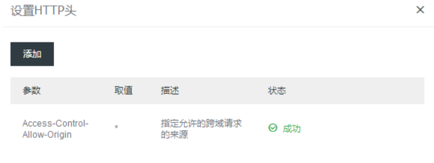

 ## 前言

一直对字体的选择理解有些模糊，自己开始总结一下。自己也是刚开始学习，见谅！

最后 **新年快乐！**

一些参考文章

[如何优雅的选择字体(font-family)](https://segmentfault.com/a/1190000006110417)

[MDN font-family](https://developer.mozilla.org/zh-CN/docs/Web/CSS/font-family)

[W3C REcommendation font](http://www.ayqy.net/doc/css2-1/fonts.html)


## 一、简介

我们需要使用`font-family`来进行字体的定义，在读一些文章和官方文档的时候，有两个属性可用一个是**字体族名**和**通用字体族名**。为了更好的理解，我用**字体名**或**通用字体名**代替，除了可以用字体名和通用字体名指代，还可以通过**`@font-face`**指定的可以下载的字体。

大致了解一下字体名和一般字体名。

**字体名** : 就是字体的名字呗，每个字体都有一个名字。

**通用字体名** :可以理解为字体名的分类，分为：**带衬线字体**、 **无衬线字体 **、**等宽字体** 、**草书字体** 、**特殊效果字体**。因为无法保证用户的计算机内已经安装了指定的字体，也不能保证使用`@font-face`提供的字体能够正确的下载，提供通用字体名，可以使得浏览七在无法获得最佳字体的情况下使用一个相对接近的备选字体。

注：通用字体名都是关键字，所以不可以加引号，加了引号系统会识别为字体名。


## 二、 字体名

[如何优雅的选择字体(font-family)](https://segmentfault.com/a/1190000006110417)

各个平台的默认字体。

#### 1. windows下

- **宋体（SimSun）**：Win下大部分游览器的默认字体，`宋体`在小字号下（如12px、14px）的显示效果还可以接受，但是字号一大就非常糟糕了，所以使用的时候要注意。
- **微软雅黑（"Microsoft Yahei"）**：从 Vista 开始，微软提供了这款新的字体，一款无衬线的黑体类字体，并且拥有 *Regular*、*Bold* 两种粗细的字重，显著提高了字体的显示效果。现在这款字体已经成为Windows游览器中最值得使用的中文字体。从Win8开始，`微软雅黑`又加入了 *Light* 这款更细的字重，对于喜欢细字体的设计、开发人员又多了一个新的选择。
- **Arial**：Win平台上默认的无衬线西文字体（为什么要说英文字体后面会解释），有多种变体，显示效果一般。
- **Tahoma**：十分常见的无衬线字体，被采用为Windows 2000、Windows XP、Windows Server 2003及Sega游戏主机Dreamcast等系统的预设字型，显示效果比`Arial`要好。
- **Verdana**：无衬线字体，优点在于它在小字上仍结构清晰端整、阅读辨识容易。
- **其他**：Windows 下默认字体列表：[微软官网](https://www.microsoft.com/typography/fonts/product.aspx?pid=161)、[维基百科](https://en.wikipedia.org/wiki/List_of_typefaces_included_with_Microsoft_Windows)、[Office字体](https://support.office.com/zh-cn/article/%E4%B8%8D%E5%90%8C%E7%89%88%E6%9C%AC%E7%9A%84-Office-%E6%8F%90%E4%BE%9B%E7%9A%84%E5%AD%97%E4%BD%93-db1101fc-5cc0-4300-91cd-de7c79d907cd?CorrelationId=e2918255-27c6-4f99-b24c-6789900e8cb2&ui=zh-CN&rs=zh-CN&ad=CN&ocmsassetID=HA010282644)
- **结论：微软雅黑为Win平台上最值得选择的中文字体，但非游览器默认，需要设置；西文字体的选择以Arial、Tahoma等无衬线字体为主。**

#### 2、Mac OS下：

- **华文黑体（STHeiti）、华文细黑（STXihei）**：属于同一字体家族系列，OS X 10.6 之前的简体中文系统界面默认字体，也是目前Chrome游览器下的默认字体，有 *Regular* 和 *Bold* 两个字重，显示效果可以接受，`华文细黑`也曾是我最喜欢的字体之一。
- **黑体-简（Heiti SC）**：从 10.6 开始，`黑体-简`代替`华文黑体`用作简体中文系统界面默认字体，苹果生态最常用的字体之一，包括iPhone、iPad等设备用的也是这款字体，显示效果不错，但是喇叭口设计遭人诟病。
- **冬青黑体（ Hiragino Sans GB ）**：听说又叫`苹果丽黑`，日文字体`Hiragino KakuGothic`的简体中文版，简体中文有 *常规体* 和 *粗体* 两种，`冬青黑体`是一款清新的专业印刷字体，小字号时足够清晰，拥有很多人的追捧。
- **Times New Roman**：Mac平台Safari下默认的字体，是最常见且广为人知的西文衬线字体之一，众多网页浏览器和文字处理软件都是用它作为默认字体。
- **Helvetica、Helvetica Neue**：一种被广泛使用的传奇般的西文字体（这货还有专门的记录片呢），在微软使用山寨货的`Arial`时，乔布斯却花费重金获得了`Helvetica`苹果系统上的使用权，因此该字体也一直伴随着苹果用户，是苹果生态中最常用的西文字体。`Helvetica Neue`为`Helvetica`的改善版本，且增加了更多不同粗细与宽度的字形，共拥有51种字体版本，极大的满足了日常的使用。
- **苹方（PingFang SC）**：在Mac OS X EL Capitan上，苹果为中国用户打造了一款全新中文字体--`苹方`，去掉了为人诟病的喇叭口，整体造型看上去更加简洁，字族共六枚字体：*极细体、纤细体、细体、常规体、中黑体、中粗体*。
- **San Francisco**：同样是Mac OS X EL Capitan上最新发布的西文字体，感觉和`Helvetica`看上去差别不大，目前已经应用在Mac OS 10.11+、iOS 9.0+、watch OS等最新系统上。
- **其他**：Mac下默认字体列表：[苹果官网](https://support.apple.com/zh-cn/HT202408)、[维基百科](https://en.wikipedia.org/wiki/List_of_typefaces_included_with_OS_X)
- **结论：目前苹方和San Francisco为苹果推出的最新字体，显示效果也最为优雅，但只有最新系统才能支持，而黑体-简和Helvetica可以获得更多系统版本支持，显示效果也相差无几，可以接受。**

#### 3、Android系统：

- **Droid Sans、Droid Sans Fallback**：`Droid Sans`为安卓系统中默认的西文字体，是一款人文主义无衬线字体，而`Droid Sans Fallback`则是包含汉字、日文假名、韩文的文字扩展支持。
- **结论：Droid Sans为默认的字体，并结合了中英文，无需单独设置。**

#### 4、iOS系统：

- **iOS系统的字体和Mac OS系统的字体相同，保证了Mac上的字体效果，iOS设备就没有太大问题。**

#### 5、Linux：

- **文泉驿点阵宋体**：类似`宋体`的衬线字体，一般不推荐使用。
- **文泉驿微米黑**：几乎是 Linux 社区现有的最佳简体中文字体。

## 三、通用字体名

**`serif`**

带衬线字体，笔画结尾有特殊的装饰线或衬线。
例如： Lucida Bright, Lucida Fax, Palatino, "Palatino Linotype", Palladio, "URW Palladio", serif.

**`sans-serif`**

无衬线字体，即笔画结尾是平滑的字体。
例如， "Open Sans", "Fira Sans", "Lucida Sans", "Lucida Sans Unicode", "Trebuchet MS", "Liberation Sans", "Nimbus Sans L", sans-serif.

**`monospace`**

等宽字体，即字体中每个字宽度相同。
例如， "Fira Mono", "DejaVu Sans Mono", Menlo, Consolas, "Liberation Mono", Monaco, "Lucida Console", monospace.

**`cursive`**

草书字体。这种字体有的有连笔，有的还有特殊的斜体效果。因为一般这种字体都有一点连笔效果，所以会给人一种手写的感觉。
例如， "Brush Script MT", "Brush Script Std", "Lucida Calligraphy", "Lucida Handwriting", "Apple Chancery", cursive.

**`fantasy`**

Fantasy字体主要是那些具有特殊艺术效果的字体。
E.g. Papyrus, Herculanum, Party LET, Curlz MT, Harrington, fantasy.

##  四、字体的规范书写

我们首先总结一下，需要有哪些值得注意的事情：以及相应的解决方案。

1. **字体中英文名称差异**：字体名称包括中文的，会又由于用户的特殊色织导致中文生命失效。

   

   在命名的过程中，尽量使用**英文字体名称**

   

2. **中英文字体内容差异**,中文字体里包括英文字母和数字，但是不够漂亮，而英文字体里，大多不包含中文。


​	设置字体的时候，**先英后中**，保证中英字体兼容到。

```
font-family: Arial,"Microsoft YaHei";
```


3. **不同的操作系统的默认字体差异**

   根据自己的受众不同，可以有不同的优先权。

4. **浏览器版本差异，有些用户使用旧版浏览器**

可以加上旧版的操作系统的字体：mac中的`"华文黑体"`,`"冬日黑体"`，win下的`黑体`


最后还需要补充一个通用字体名，以防万一。一般非衬线字体在显示器中显示效果会比较好，所以我们在最后添加`sans-serif`。


下面，从上面的文章中查看了一下大公司的常见写法以供参考（2016.07查看)

**小米**

```
font: 14px/1.5 "Helvetica Neue",Helvetica,Arial,"Microsoft Yahei","Hiragino Sans GB","Heiti SC","WenQuanYi Micro Hei",sans-serif;
```

**简书**

```
font-family: "lucida grande", "lucida sans unicode", lucida, helvetica, "Hiragino Sans GB", "Microsoft YaHei", "WenQuanYi Micro Hei", sans-serif;
```

## 五、font-face规则

[css背景下的font-face规则](https://www.zhangxinxu.com/wordpress/2017/03/css3-font-face-src-local/)

首先`@font face`规则是语序网页开发者为网页指定在线字体。可以消除对用户电脑字体的依赖。

我们通过src属性：

`local()`指定本地的字体。

`url("")`指定网页字体。

当使用url的时候，会出现跨域的问题（cors policy）,由于站点服务器，没有指定允许跨域请求，就导致了字体无法正确的加载问题。

如果是自己的服务器，可以将Access-Control-allow-origin 设置为 * 即可。



