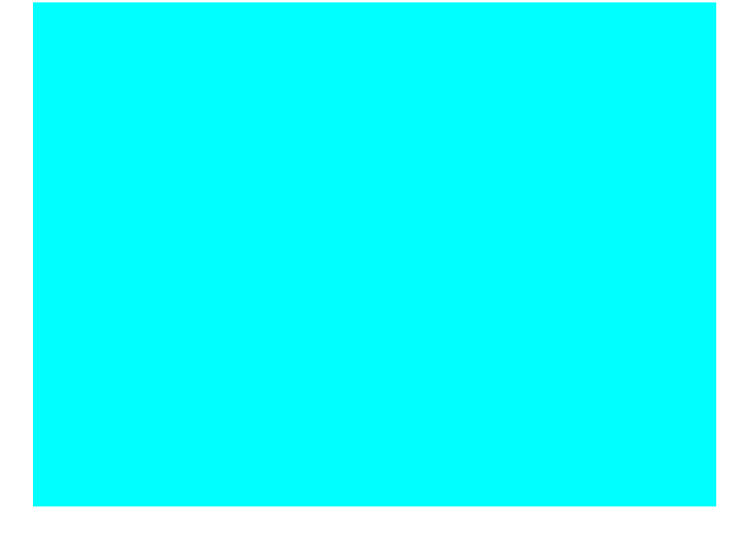
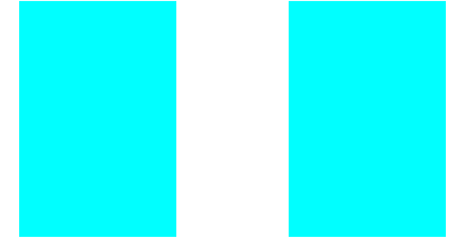
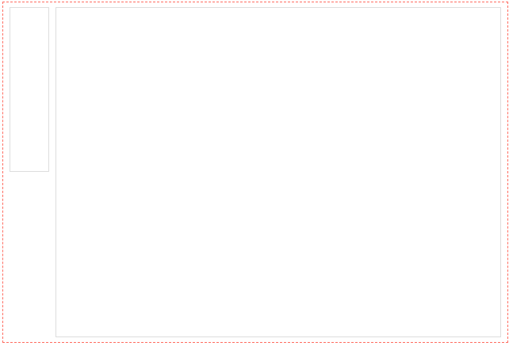
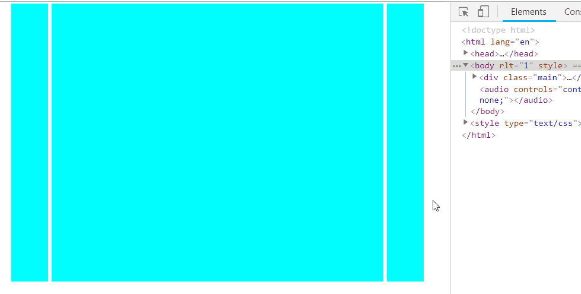
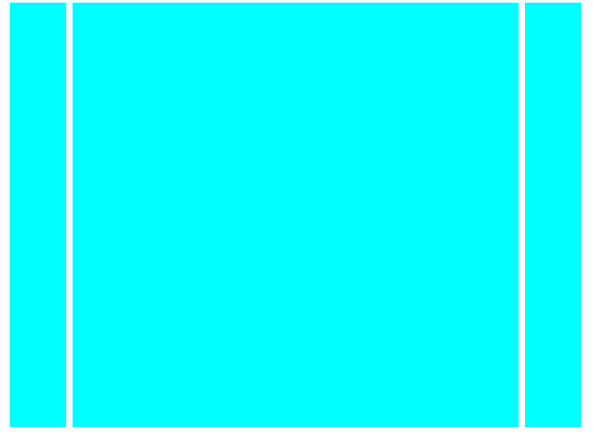
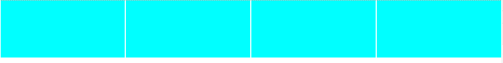
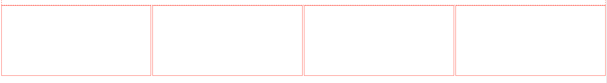

从我看到的，知道的，全面的总结一下。CSS常见布局。

## 一、单列布局

单列布局，通常定宽（可以使用%，可以实现自适应，也可以直接确定宽度大小）并利用`margin: auto`进行水平居中

```
<div class="main"></div>

        
        .main {
            width: 90%;
            height: 2000px;
            background-color: aqua;
            margin: 0 auto;
        }
```



## 二、双列布局

#### 1. 定宽双列布局

常见利用float 进行布局

1. 左边左浮动，右边右浮动。(或均为左浮动)
2. 需要清除浮动。
3. 可以修改盒子模型为`border-box`

```
  <div class="main">
        <div class="left"></div>
        <div class="right"></div>
    </div>


        .main {
            width: 90%;
            margin: 0 auto;
            overflow: hidden;/*触发BFC，清除浮动*/
        }
        .left {
            width: 1000px;/*也可以使用百分比*/
            height: 1500px;
            float: left;
            background-color: aqua;
        }

        .right {
            width: 1000px;/*也可以使用百分比*/
            height: 1500px;
            float: right;
            background-color: aqua;
        }
```



#### 2. 左侧固定，右侧自适应

创建基本的html布局,要求：两个`div`之间相距20px，左侧`div`宽120px

```
<div class="main">
        <div class="left"></div>
        <div class="right"></div>
    </div>

```

**双`inline-block`**

```css
        .main {
            padding: 15px 20px;
            border: 1px dashed #ff6c60;
            font-size: 0;
        }
        .left {
            margin-right: 20px;
            display: inline-block;
            width: 120px;
            height: 500px;
            font-size: 14px;
            border: 1px solid #ddd;
            vertical-align: top;/*上端对齐*/
            box-sizing: border-box;
        }
        .right {
            display: inline-block;
            width: calc(100% - 140px);/*注意：当父容器存在padding时100% 不算padding*/
            height: 1000px;
            font-size: 14px;
            border: 1px solid #ddd;
            vertical-align: top;/*上端对齐*/
            box-sizing: border-box;
        }
```

1. 需要准确确定子容器的宽度，需要`border-box`模型
2. 需要消除空格的影响，需要父容器`font-size : 0`
3. 使顶端对齐，`vertical-align: top`



这里需要重新学习一下linebox模型。

**双`float`**

```
        .main {
            overflow: hidden;/*清除浮动带来的影响*/
            padding: 15px 20px;
            border: 1px dashed #ff6c60;
        }
        .left {
            width: 120px;
            height: 500px;
            box-sizing: border-box;
            border: 1px solid #ddd;
            float: left;
            margin-right: 20px;
        }
        .right {
            width: calc(100% - 140px);
            height: 1000px;
            box-sizing: border-box;
            border: 1px solid #ddd;
            float: left;
        }
```


**`float+ margin-left`**

1. 左边左浮动
2. 右边计算`margin-left`
3. 清除浮动。

```
        .main {
            overflow: hidden;/*清除浮动带来的影响*/
            padding: 15px 20px;
            border: 1px dashed #ff6c60;
        }
        .left {
            width: 120px;
            height: 500px;
            box-sizing: border-box;
            border: 1px solid #ddd;
            float: left;
        }
        .right {
            width: calc(100% - 140px);
            height: 1000px;
            box-sizing: border-box;
            border: 1px solid #ddd;
            margin-left: 140px;
        }
```

**`absolute+margin-left`**

1. 左边绝对定位（父元素设置position)
2. 右边计算margin-left。

```
        .main {
            padding: 15px 20px;
            border: 1px dashed #ff6c60;
            position: relative;
        }
        .left {
            width: 120px;
            height: 500px;
            box-sizing: border-box;
            border: 1px solid #ddd;
            position: absolute;
        }
        .right {
            width: calc(100% - 140px);/*不设置宽度也可以,由里面自由撑开*/
            height: 1000px;
            box-sizing: border-box;
            border: 1px solid #ddd;
            margin-left: 140px;
        }
```

注意：没有清除绝对定位的方法，若左侧盒子高于右侧盒子，就会超出父容器的高度。因此只能通过设置父容器的`min-height`来防止这种情况。

**使用`float+BFC`**

上面的方法都是需要通过左边盒子的宽度来计算某一个值，下面的三个方法不需要计算。

将右边盒子`BFC`。

**`flex`方案**

```
        .main {
            padding: 15px 20px;
            border: 1px dashed #ff6c60;
            display: flex;
            align-items: flex-start;
        }
        .left {
            width: 120px;
            height: 500px;
            border: 1px solid #ddd;
            flex: 0 0 auto;
            margin-right: 20px;
        }
        .right {
            height: 1000px;
            border: 1px solid #ddd;
            flex: 1 1 auto;
        }
```

`flex`容器的一个默认属性值:`align-items: stretch;`。这个属性导致了列等高的效果。
为了让两个盒子高度自动，需要设置: `align-items: flex-start;`

**`grid`方案**

暂时没有进行学习，今日不适合学习，待续。。。


## 三、三列布局

#### 1.  两侧定宽，中间自适应

##### 使用float浮动

1. 设置父元素宽度，
2. 设置左左右浮动。
3. 中间元素用到calc()来计算所需宽度，达到自适应。
4. 使用`margin`调整间距，也可以全部左浮动。
5. 需要清除浮动带来的影响。

```
<div class="main">
        <div class="left"></div>
        <div class="middle"></div>
        <div class="right"></div>
    </div>
    
    
        .main {
            width: 90%;
            margin: 0 auto;
            overflow: hidden;/*触发BFC，清除浮动*/
        }
        .left {
            width: 200px;/*也可以使用百分比*/
            height: 1500px;
            float: left;
            background-color: aqua;
            margin: 0 10px;
        }

        .right {
            width: 200px;/*也可以使用百分比*/
            height: 1500px;
            float: right;
            background-color: aqua;
            margin: 0 10px;
        }
        .middle {
            width: calc(100% - 460px);
            height: 1500px;
            float: left;
            background-color: aqua;
            margin: 0 10px;
        }
```



##### 使用定位

1. 为父元素设置relative定位。
2. 分别定位各个子元素
3. 确定间距。

(不建议使用，因为使用绝对定位，后面加入内容的时候会被覆盖)

```
    <div class="main">
        <div class="left"></div>
        <div class="middle"></div>
        <div class="right"></div>
    </div>
        .main {
            width: 90%;
            margin: 0 auto;
            position: relative;
        }
        .left {
            width: 200px;/*也可以使用百分比*/
            height: 1500px;
            position: absolute;
            left: 10px;
            background-color: aqua;
        }

        .right {
            width: 200px;/*也可以使用百分比*/
            height: 1500px;
            position: absolute;
            right: 10px;
            background-color: aqua;
        }
        .middle {
            width: calc(100% - 460px);
            height: 1500px;
            position: absolute;
            left: 230px;
            background-color: aqua;
        }

```




**`padding+负margin`(圣杯布局)**

此原理来自这篇文章。

[圣杯布局In Searh of the Holy Graid](https://alistapart.com/article/holygrail)

这篇文章给出了一个不一样的解决方案，在此我有一些修改，清除浮动的方式改为了`overflow: hidden;`

要求：左边宽度为 200px，右边150px，中间自适应。

基本的结构如下：

```
    <div id = "container">
        <div id="center" class="column"></div>
        <div id="left" class="column"></div>
        <div id="right" class="column"></div>
    </div>
```

基本的css样式如下(为了更好的显示，所以设置了边框，将`box-sizing`设置为`border-box`模型)：

```
		#container {
            padding-left: 200px;
            padding-right: 150px;
            overflow: hidden;
            border: 1px dashed #ff6c60;
        }
        #container .column {
            border: 1px solid #ff6c60;
            box-sizing: border-box;
        }
        #center {
            width: 100%;
            height: 1000px;
        }

        #left {
            width: 200px;
            height: 100px;

        }

        #right {
            width: 150px;
            height: 100px;
        }
        
        
```

将左侧弄到上面去

```
#left {
    position: relative;
    margin-left: -100%;
    right: 200px;
    
}
#right {
        margin-right: -150px;
}

```

就OK了！

【注】

1. 为了使其更加完美，可以在body上加入,防止因浏览器窗口过小，而导致布局失效。

   ```
   body {
       min-width:..;
   }
   ```

   

2. 需要添加一些padding让布局更加的完美。只需要将left和right 的宽度保持住就可以。

   

   **双飞翼实现三列布局**

   双飞翼和圣杯是一样的道理，只是实现的原理不一样，所以起了不同的名字。

对于圣杯，我们没有添加额外的标签，而双飞翼需要为center加一个额外的div，首先我们先将页面的基本结构搭建起来。

```
<div id="header"></div>
    <div id = "container">
        <div id="center" class="column">
            <div id="inner-center"></div>
        </div>
        <div id="left" class="column"></div>
        <div id="right" class="column"></div>
    </div>
<div id="footer"></div>
```

和圣杯布局一样，只不过需要将，padding 用 margin来进行实现。

css代码如下：

```
        #header {
            width: 100%;
            height: 50px;
            background-color: aliceblue;
        }

        #container {
            overflow: hidden;/*触发BFC，清除浮动影响*/
            border: 1px dashed #ff6c60;
        }
        #footer {
            width: 100%;
            height: 50px;
            background-color: aliceblue;
        }

        .column {
            float: left;
        }
        #center {
            width: 100%;
        }
        #inner-center {
            height: 1000px;
            margin-left: 200px;
            margin-right: 150px;
            background-color: aqua;
        }

        #left {
            width: 200px;
            height: 100px;
            margin-left: -100%;
            background-color: aqua;
        }

        #right {
            width: 150px;
            height: 100px;
            margin-left: -150px;
            background-color: aqua;
        }

```

## 四、等分布局

#### 1. 常规实现

我们用四个子元素来进行等分。父元素默认100%宽度， 子元素要平均分为四份。间距为10px;

基本的html结构如下：

```
<div class="father">
    <div class="son"></div>
    <div class="son"></div>
    <div class="son"></div>
    <div class="son"></div>
</div>
```


1. 子元素设置浮动。
2. 设置`margin-right: 10px`,宽度则为`calc(25% - 10px)`
3. 父元素清除浮动。使用负边距，将最后一个`margin-left`清除。

```
        .father {
            overflow: hidden;
            margin-right: -10px;
        }
        .son {
            width: calc(25% - 10px);
            height: 500px;
            float: left;
            margin-right: 10px;
            background-color: aqua;
        }
```



**关于负边距更多的探讨，计划下篇文章总结一下。**

#### 2. flex 实现

同样需要父容器使用负边距来进行清除带来的影响。

html基本代码同上

```
       .father {
            display: flex;
            margin-right: -10px;
        }
        .son {
            flex: 1 1 auto;
            align-items: flex-start;
            height: 500px;
            border: 1px solid #ff6c60;
            margin-right: 10px;
        }
```




（完）🙃