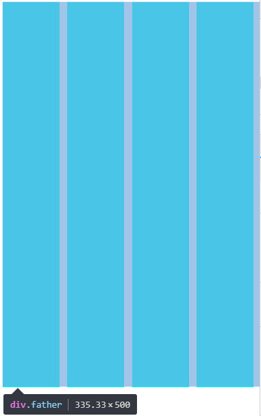

## 前言

在进行布局学习的时候，发现经常用到负边距这一技巧。学的总是不够清晰，进行总结一下。

## 一、负边距的理解

所谓负边距，就是（negative margin)。

其实盒子模型的整体结构，就包括了`margin ，border，padding，width，height`  如果`margin`设置成了负的话，那么也就是说这个盒子所占据的空间就会小。

## 二、在给定宽度元素中使用

我们默认的`position`就是`static`，以`static`为例。

当这个宽度元素是一定的时候：


1. `static`元素在`top/left`使用用负边距的时候，他的作用就是将元素像这个方向移动 如：

```
{
	margin-top: -10px;/*意思就是将这个元素向上移动10px*/
}
```

2. 当设置`bottom/right`时，它并不会使他向右或向下移动，而是将后面的元素拉向自己，从而覆盖自己。

这些也都很好理解。

#### 应用

之前写过的布局，圣杯布局，双飞翼布局就是此项技术的应用。

## 三、 在非定宽使用负边距

**在不使用定宽的情况下，元素会默认和父元素的宽度一致**

这就是为什么我们没有为body设置宽度，他就能够铺满屏幕一样。

如下面的案例。

```
<div class="father">
    <div class="son"></div>
</div>
```

```
        .father {
            width: 300px;
        }

        .son {
            height: 1000px;
            background-color: aqua;
            margin-right: -10px;
        }
```

打开调试台，我们发现，父元素`.father`的宽度和设置的一样`300px`。然而再看一下子元素。


由于我们加了一个`margin-right: -10px;`惊讶的发现，里面的宽度变成了310px，并且溢出到了父元素外面，看起来被拉长了一样。这是一个匪夷所思的问题，目前我也没有找到相关的解释，后续在慢慢学习。

#### 应用

此项技术的应用，就是之前我们写过的四列布局，在父元素的

之前我们的代码是这样的

```
 .father {
            overflow: hidden;
            margin-right: -10px;
        }
        .son {
            width: calc(25% - 10px);
            height: 500px;
            float: left;
            margin-right: 10px;
            background-color: aqua;
        }
```


```
<div class="father">
    <div class="son"></div>
    <div class="son"></div>
    <div class="son"></div>
    <div class="son"></div>
</div>
```

我们可以发现`.father`这里没有确定宽度，如果我们试着给`.father`设置宽度为100%，我们发现最后一列的元素没有清理掉`margin-right`,变成了第一种定宽负边距的情况，只对他后面的元素有影响。

现在我们把宽度省略掉，我们给父元素`overflow: scroll`，发现并没有如员的增加滚动条，这说明并不是`overflow: hidden;`在起作用，真的是由于`father`发生了改变，从而使得他能够清除掉。

由前文所述，未设置宽度时，负边距会增加内容的宽度。

在未加入负边距之前，`father`是这样的:

​​

加入了负边距之后：



父元素向右增加了10px，导致了内部的元素，重新分配了空间，同时感觉向右偏移了，导致了视觉上的清除最右边的margin。效果不错。


（完）🙃