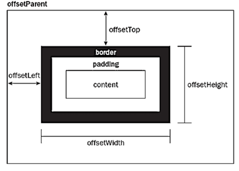

通过css的`calc()`可以动态的设置元素的尺寸，相应的用途和一些用法，[点击这篇文章](https://www.w3cplus.com/css3/how-to-use-css3-calc-function.html)

如何通过JS获取到相应的`width`或`height`呢？ 

## 直接获得？

以下是一个简单的html

```
<div class="wrap">
        <div class="box"></div>
</div>
```

添加样式

```
    <style>
        .wrap {
            width: 300px;
            height: 200px;
            margin: 10px;
            padding: 10px;
            border: 1px solid olivedrab;
            background-color: aqua;
        }
        .box {
            width: 100px;
            height: 100px;

            margin: 10px;
            padding: 10px;
            border: 1px solid olivedrab;
            background-color: aliceblue;
        }
    </style>
```

注意我们使用js

```
var wrap = document.getElementsByClassName("wrap")[0];
var wrapWidth = wrap.style.width;
console.log(wrapWidth);
```

我们发现这样是获取不到宽度的！JS无法获取得到CSS中的属性，除非html的代码中，显式的给出style，并设置它的宽度，如下

```
<div class="wrap" style="width: 100px;">
        <div class="box"></div>
</div>
```

才能在JS中获取得到。

```
var wrap = document.getElementsByClassName("wrap")[0];
var wrapWidth = wrap.style.width;
console.log(wrapWidth);//100px
```

## 了解三个尺寸

JS的**element对象**提供了三个尺寸`offsetHeight` `scrollHeight` `clientHeight`（都有对应的width）。

[演示三个尺寸的demo，点击这里。](https://ztyzz.github.io/blogDemo/demo1/index.html)

由上面的演示我们可以知道。

`offsetHeight`的值 = `padding`+`border`+ `height`

`scrollHeight`的值= `padding`+`height`（不算边框）

`clientHeight`的值 = `padding`+`height`-`滚动条的高度`（不算滚动条）





## `window`对象的getComputedStyle

获取当前元素所有最终使用的css属性值。包括默认的和后给出的。所以理论上使用getComputedStyle就可以满足了需求，从而获取到元素的尺寸。

【注意】getComputedStyle获取到的是可读的。`window.getComputedStyle(element,"伪类")；`可以目前第二个参数不是必需参数了。

下面的两篇文章，需要细细研读。

[获取元素CSS值之getComputedStyle方法熟悉](https://www.zhangxinxu.com/wordpress/2012/05/getcomputedstyle-js-getpropertyvalue-currentstyle/)

[伪类+js实现CSS3 media queries跨界准确判断](https://www.zhangxinxu.com/wordpress/2012/05/after-js-content-css3-media-queries/)