【注】针对的是ES5, 循序渐进，作者是新手啊啊啊啊 ，在学习中，错误在所难免，大家见谅。


在进行正式函数讲解时，需要知道一个概念----**作用域**。

## 作用域

**在JavaScript只有函数能够创建局部作用域！**

**只有函数能够创建局部作用域！**

**只有函数能够创建局部作用域！**

重要的事情说三遍！所以在最外层的就是全局作用域（也可以叫做全局环境），而函数内部则是局部作用域（也可以叫做局部环境。）

在web浏览器中，全局作用域其实就是**window对象。**


知道了这个我们就可以愉快的进行下一项了！JavaScript的函数还挺重要的首先还是从 函数的创建开始，在JavaScript有两种方式进行函数的创建！

## 两种方式创建函数

#### 1. 函数声明

类似于下面的这种代码，把一个人变成猪。

```
function toPig(age) {
    console.log("你是一头"+age+"岁的猪!");
}

toPig(12);//你是一头12岁的猪!

```

关于函数声明，它能够进行提升，所谓提升就是 在执行代码之前它会先读取函数声明。也就是说上面的函数这么写没有关系。

```
toPig(12);//你是一头12岁的猪!

function toPig(age) {
    console.log("你是一头"+age+"岁的猪!");
}

```

那 我们 在进行一个实验，试想一下这种会显示什么呢？

```
toPig(12);//你是一头12岁的猪!
toBigPig(12);//error

function toPig(age) {
    console.log("你是一头"+age+"岁的猪!");
      function toBigPig(age) {
        console.log("你已经是一头"+age+"岁的大猪了!该学会自己生活了!");
    }
}

```

如上所示，第一个是正常显示的，第二个是error。

```
toPig(12);//你是一头12岁的猪!

function toPig(age) {
    console.log("你是一头"+age+"岁的猪!");
    toBigPig(12);//你已经是一头12岁的大猪了!该学会自己生活了!
    function toBigPig(age) {
        console.log("你已经是一头"+age+"岁的大猪了!该学会自己生活了!");
    }
}

```

所以我们可以知道，这里面的提升，也仅仅是提升到当前作用域的顶部，而不能进行跨域提升。

#### 2. 函数表达式（函数字面量）

我们之前说过字面量，函数字面量和对象字面量是一个意思。见下面的代码。

```
var toPig = function (age) {
    console.log("你是一头"+age+"岁的猪!");
};

```

如果我们在 函数字面量之前，进行调用：

```
toPig(12);//error
var toPig = function (age) {
    console.log("你是一头"+age+"岁的猪!");
};

```

会出现错误。

如果在后面就没有任何问题。所以我们可以把函数字面量简简单单的当作复制，把函数赋值给变量的过程而已，所以解释器没有那么智能，变量还没有赋值，就会提前知道他是什么东西。（在调用toPig(12)的时候，函数还没赋值给变量)


## 闭包

就如上面的例子所说的，在作用域外，我们没有办法进行访问到另一个函数内部的函数，而闭包就是解决这一问题的，它是指有权访问另一个函数作用域中的变量和函数。

#### 函数被调用时发生了什么？

以下面的函数为例，我们来看一下在调用时到底会发生什么？

```
/**
 * 比较两个数的大小
 * 如果数1比数2大，返回1
 * 如果数1比数2小，返回-1
 * 两个数相等返回0
 */
function compare(value1,value2) {
    if(value1>value2) {
        return 1;
    }
    else if(value1<value2) {
        return -1;
    }
    else {
        return 0;
    }
}

//调用函数
var result = compare(234,123);
console.log(result);
```

我们把它放在浏览器中，进行执行，设置断点进行执行。

在函数外边，和 调用函数之前设置断点，然后点击运行。

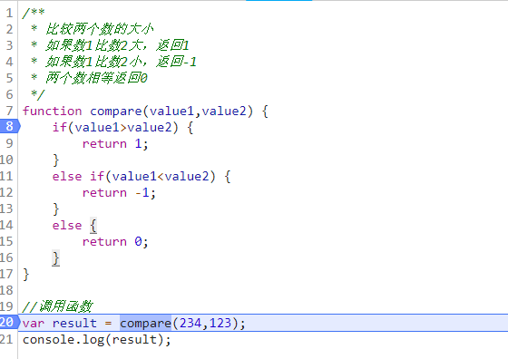

可以发现函数没有进入到compare内部，而是直接到了赋值和调用，由于我们设置了断点，所以就停止了。

首先要知道的是，在浏览器中运行环境其实就是全局对象，是一个window对象，我们在浏览器中能够看到：


把它打开能够看到他有这么多的属性和方法。

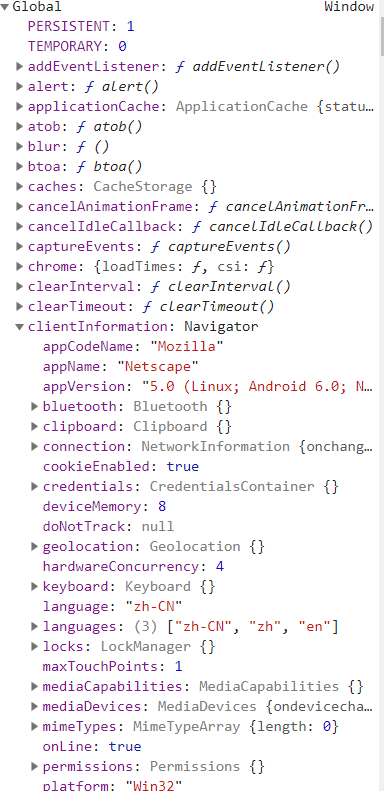

这还没有截完整。在全局作用域下，会首先有一个全局对象（window），在上面的代码中，我们就可以找到如下：

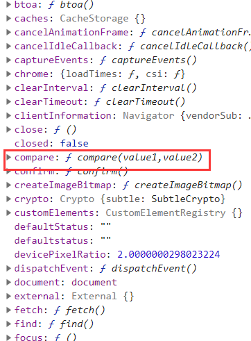

而result则是在这个位置：

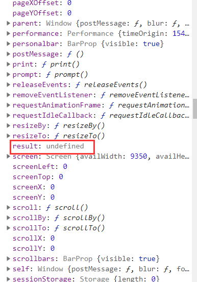


接下来我们一步一步，看看内部到底发什么什么？JavaScript究竟是怎么调用函数的。

1. 我们省略不要的属性，可以理解为这样的结构：比如上述的compare和result两个变量。由于result是还没有调用函数的，是undefined。那compare是啥呢？

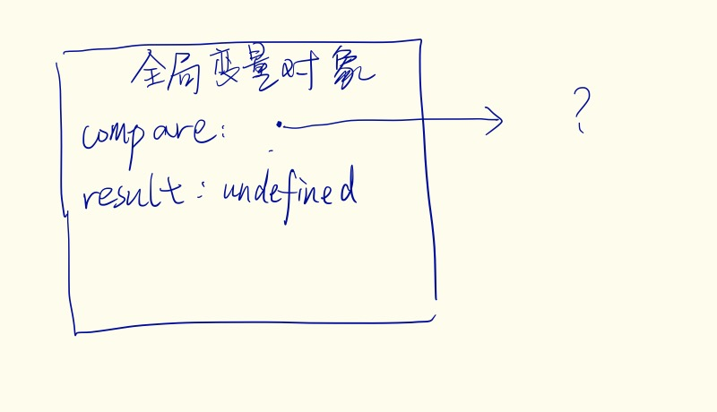

2. 我们打开compare查看一下里面到底是什么。

   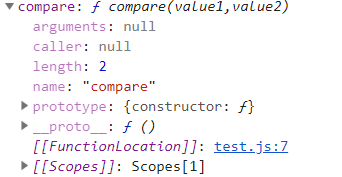

   

   首先里面有一个arguments对象，目前还没调用，所以都是null。caller也是null，prototype和我们之前的一样，注意到有一个[[Scopes]]对象，这个是什么呢？我们展开看一下：
   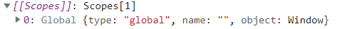

   其实在进行函数声明的时候，会有一个作用域链的东西存在，就是如上面的结构。

   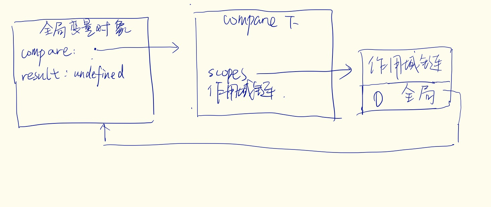

   这也是为什么在函数内部，能够访问全局作用域的变量，因为有一个作用域链存在！接下来我们step over。

3. 函数被调用，由于设置断点，所以进行到了函数内部停止。

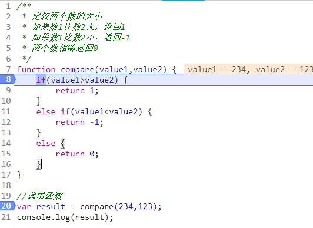

此时，我们发现出现了一个局部环境，这个环境内部 有一个this 对象，此时指向的是 window。同时也存在了两个值，value1 和 value2

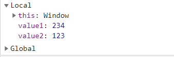

我们看一下compare函数内部有什么变化呢？

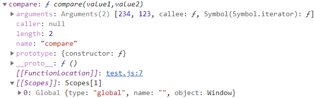

arguments进行了改变，将值都传进去了。


4. 继续step over 直到 return 1；

   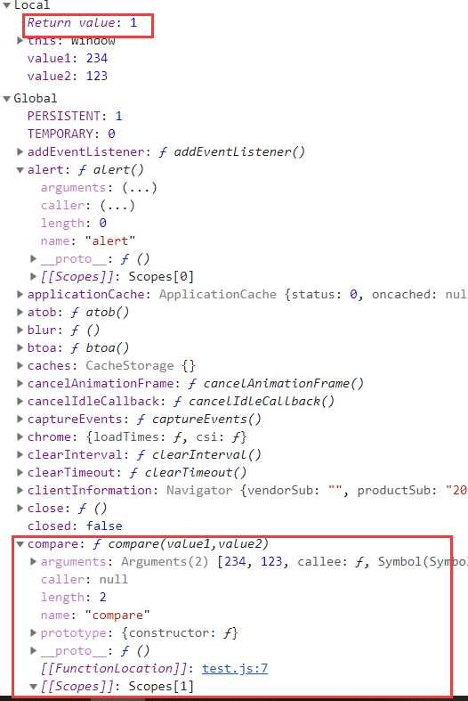

   

其他部分没有变化。

5. 继续step over 。退出函数。

Local作用域消失，而Global 则和初始化是一样的arguments 和 caller 等都是null，而 result 则接受返回的值，变成了1。


至此函数调用已经完成。


#### 总结

上面的一切无非是在说明两个事情！

1. 由于作用域链的存在，能够在函数的局部作用域内访问到全局作用域的变量。
2. 函数运行完毕，对象便会自动销毁。

#### 实现闭包

针对闭包，参见这篇文章，看完立即就懂了！[什么是闭包](https://zhuanlan.zhihu.com/p/22486908?refer=study-fe)

闭包就是 **函数**和**函数内部能够访问到的变量。**


##### 1. 创建函数

为了首先创建一个不被外界访问到的局部变量，所以需要一个函数，这个函数就是如下createComparisionFunction()。

如下：

```
function createComparisonFunction(propertyName) {
}
```

**2. 创建局部变量**

```
function createComparisonFunction(propertyName) {
}
```

还是没有变化，为什么呢？因为propertyNam这个参数就可以当作一个局部变量了，其他人访问不到他。如上面链接中的文章中写的一样，有时我们需要一个声明`var live = 30;`这种写法。

**3. 创建实际的函数**

我们创建好了一个这个包之后，就要创建一个函数，来实现闭包，如下：

```
function createComparisonFunction(propertyName) {
    function comparison(object1,object2) {
        var value1 = object1[propertyName];
        var value2 = object2[propertyName];
        if (value1 > value2) {
            return 1;
        }
        else if (value1 < value2) {
            return -1;
        }
        else {
            return 0;
        }
    };
}
```

**4. return 这个函数**

我们已经完成了 但是别忘了我们这样写是调用不了的，而是要把这个函数返回，才能使用！

```
function createComparisonFunction(propertyName) {
    function comparison(object1,object2) {
        var value1 = object1[propertyName];
        var value2 = object2[propertyName];
        if (value1 > value2) {
            return 1;
        }
        else if (value1 < value2) {
            return -1;
        }
        else {
            return 0;
        }
    };
    return comparison;
}
```


大功告成！当然我们可以一步到位！↓↓↓↓↓

```
function createComparisonFunction(propertyName) {
    return function(object1,object2) {
        var value1 = object1[propertyName];
        var value2 = object2[propertyName];
        if (value1 > value2) {
            return 1;
        }
        else if (value1 < value2) {
            return -1;
        }
        else {
            return 0;
        }
    };
}
```


## 模仿块级作用域

由于JavaScript没有块级作用域，只能通过函数来进行。

看如下代码

```
function outputNumbers(count) {
    for(var i = 1;i <= count; i++) {
        console.log(i)
    }
    console.log(i);
}

outputNumbers(3);
//结果
//1
//2
//3
//4
```

正常在其他的语言中，我们在for 内部定义的一个变量，在结束时，就会销毁，但是JavaScript 由于没有块级作用域，所以即使被`{}`扩住，还是处于函数内部的作用域中，在outputNumbers内部随时可以访问到这个变量！

要和其他语言一样，我们需要这样思考。

肯定函数，因为只有函数才能有局部作用域啊。还必须得是匿名函数！

```
function(){}
```

接下来呢我们需要这样一个语法，让这个声明变成一个表达式。

```
(function(){
    
})
```

之后在进行调用。

```
(function(){
    
})();
```

哈哈哈，大功告成！任何你想`{}`的地方，都可以用这种结构代替，如之前所示。我们可以这样写：

```
function outputNumbers(count){
    (function(){
        for(var i = 0;i<count;i++) {
            console.log(i+1);
        }
    })();
    //console.log(i);错误访问不到
}

outputNumbers(3);
//1
//2
//3
```


（完）

## 更新

1.19 增加块级作用域。