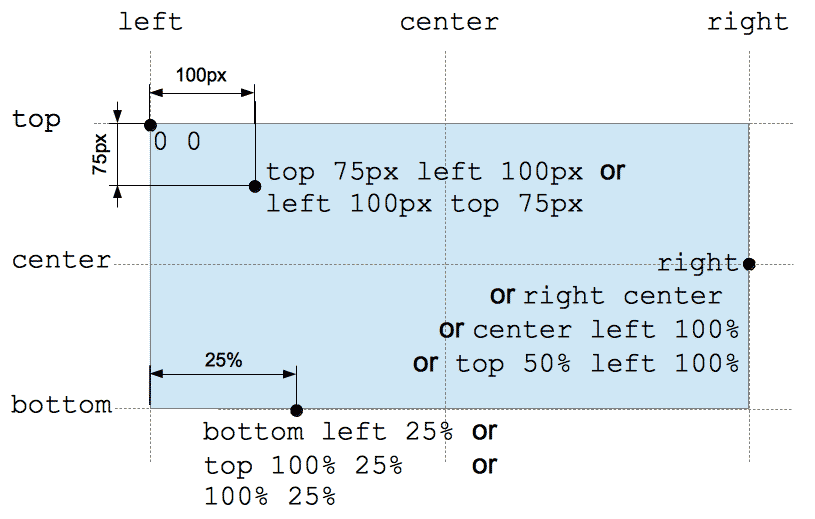
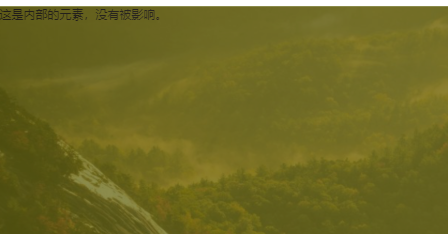
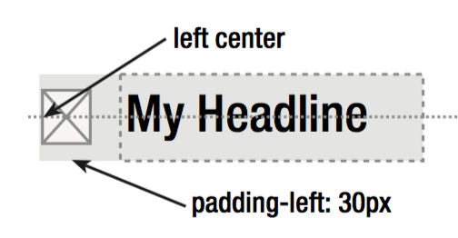

## 前言

学习的过程是应该不断探索和总结的。以我为例，我认为我是一个相对愚笨，有没有很强的自制力，学习也爱耍些”小聪明“，总感觉自己懂了，但是每次一到自己进行书写的时候，又总是模模糊糊。我做了以下几件事

1. 我强迫自己慢下来，不必追求进度，不去想自己的未来、自己能不能找到工作（当你处于忧虑之中，就会无形的耗费自己的精力)。
2. 强迫自己写博客文章，遇到不懂的就及时总结和梳理自己的疑惑。
3. 要有个大致的方向，避免一个知识点钻牛角尖到底，忽略了自己本来的方向。

所以这些文章都是我自己的总结和疑惑，我希望能够拥有一个博客网站，发些文章，有人浏览。继续努力！

本篇文章就是针对背景图的定位，和一些小图标的定位问题，进行的总结。可能不够全面和专业。


## 背景图background属性

使用背景图，来进行页面的设计，主要用到`background`属性。我们先把一些简单的写出来，之后再探讨难一点的。

`background-clip`:设置元素的背景是否延伸到边框下面。属性有： `border-box` `padding-box``content-box`

`background-color`设置背景色。

`background-imgage`设置背景图，通过`url("")`进行设置。

`background-attachment`决定背景是在视口中固定的还是随包含它的区块滚动的。

`fixed`此关键字表示背景相对于视口固定。

`scroll`背景相对于元素本身固定，而不是随着他的内容滚动。如果父元素设置为`overflow: auto;`或`scroll`出现滚动条的时候，那么负负得正，背景图固定。

`local`表示背景相对于元素的内容固定。有`scroll`背景相对于元素本身固定，如果父元素设置为`overflow: auto;`或`scroll`出现滚动条的时候，背景图随元素运动。

下面一些比较复杂的属性。

#### `background-position`

一图以避之，这个属性可以是具体数值，也可以是百分比也可以是`left` ` top ` `bottom` `right` `center`。



百分比布局则是，父元素的百分比和子元素的百分比共同决定的，也就是说使用

```
background-position: 100% 100%;
```

使得元素定位到了父元素的右下角。

#### `background-size`

设置背景图片的大小，可以保持原有尺寸，或拉伸到新的尺寸。或者再保持原有比例进行缩放。

属性值：

`数值`指定背景图片大小。

`百分比`指定背景图片相对背景区的百分比。

`auto`以背景图片的比例缩放背景图片。

`cover`缩放背景图片覆盖背景区。（不会被压扁）

`contain`缩放背景图片完全装入背景区，可能背景区部分空白。

```
/* 关键字 */
background-size: cover
background-size: contain

/* 一个值: 这个值指定图片的宽度，图片的高度隐式的为auto */
background-size: 50%
background-size: 3em
background-size: 12px
background-size: auto

/* 两个值 */
/* 第一个值指定图片的宽度，第二个值指定图片的高度 */
background-size: 50% auto
background-size: 3em 25%
background-size: auto 6px
background-size: auto auto
```

## 三、背景图的实践

#### 1. 百分百充满容器

如何将网页的背景设置为一张图片（100%充满背景，不重复）？

+ 不考虑拉伸的情况。可以设置为`background-size: 100% 100%;`

+ 保持原比例，设置为：`background-size: cover;`

#### 2. 设置遮罩

有时，设计时图片上面会有一些遮罩，以实现交互效果。

+ 如果没有交互效果，可以在原设计图上面直接将遮罩和背景一起合成一张图片，直接应用这张图片就好了。

+ 由于`background-color`和`background-image`可以同时设置，所以可以用`background-color`进行设置遮罩。设置透明度使用`opacity`属性（0-1.0)。

  注意：`opacity`属性是设置元素的不透明度，所以对于未设置的元素，是不会影响其透明度的。

  所以我们需要为遮罩加一个`div`标签。如下：

  ```
  <div id="header">
          <div class="header-mask">
              <p>这是内部的元素，没有被影响。</p>
          </div>
  </div>
  ```

  ```
  #header {
              height: 1500px;
              background: url("images/Background.png") no-repeat;
              background-size: cover;
  
          }
          #header .header-mask {
              widht: 100%;
              height: 100%;
              background-color: yellow;
              opacity: 0.25;
          }
  ```

  效果如图：

  

+ 也可以通过`rgba()`进行遮罩的设置，如`rgb(0,0,0,.4)`注意，这种方法还是需要加一个标签的和上面类似。因为如果在背景图上面再加颜色会显示不出来，被挡住了。
+ 如果为了更加符合语义化，可以将上面后加的标签去除，使用`after`伪元素。

#### 3. 设置图标



```
h1 {
   padding-left: 30px;
   background: url(icon.png) no-repeat left center;
}
```

