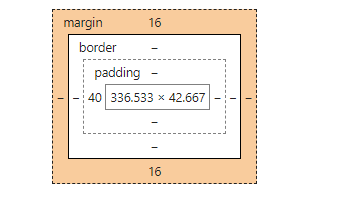
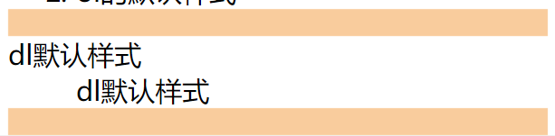
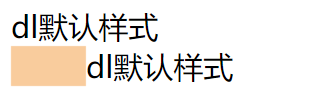
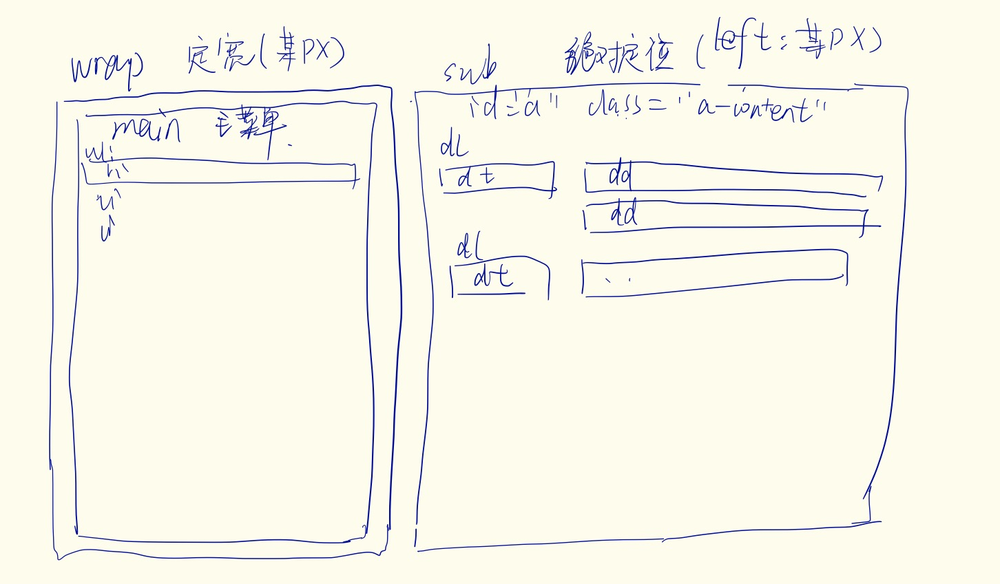
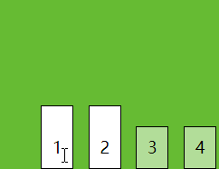
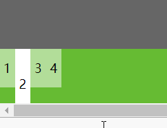
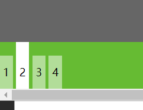

首先导航栏可以叫做链接列表。这样我们就能够清楚的知道，该如何进行制作了。

我们使用`列表元素 + 链接元素 = 列表链接（导航栏）`

为此 我制作了一个demo，效果展示在这里[点击三种导航栏的制作](https://ztyzz.github.io/blogDemo/demo2/index.html)

## 前言

在进行导航栏制作之前。我们需要知道，html中的列表中有一个默认的样式。如图所示



对于`ol`和`ul`两种标签，有个默认的属性，`padding-left=40px`而`margin-top`和`margin-bottom`为16px。






对于`dl`这种元素来说。dl标签 有`margin-top`和 `margin-bottom`均为16px。对于`dd`有`margin-left`为40px。


## 水平导航栏

由于使用列表元素，都会有一个默认的样式，所以我们在进行导航栏制作的时候，一定要将这些样式去除掉。

```
ul {
    list-style-type: none;
    padding: 0;
    margin: 0;
}
```

```
li a {
    text-decoration: none;
}
```


两种方式创建水平导航栏，一种是`display:inline-block`一种是 `float`

#### `display:inline-block`

同样的

```
/*修改默认样式*/
ul {
    list-style-type: none;
    padding: 0;
    margin: 0;
    background-color: #333;
}

/*修改链接样式*/
li a {
    color: white;
    display: inline-block;/*注意如果要更改a链接的尺寸，必须给他block化*/
    width: 50px;
    text-decoration: none;
}
/*将列表水平化*/
li{
    display: inline-block;
    text-align: center;
}

/*更改悬浮状态*/
li a:hover {
    background-color: #111;
}
/*给出一个active类 进行导航激活状态显示*/
li a.active {
    background-color: #4CAF50;
}
```

我们可以看上面的demo第一个效果。

需要注意的是 ，我们在进行`display:inline-block`的时候发现，block 和 block之间会有一个空格显示，之前的文章探究过这个问题，这是由于`<li>`元素与`<li>`元素中间的回车符导致的。所以我们需要将html的代码写成这样。

```
<ul class = "menu1">
      <li><a class = "active"  href="#">首页</a></li><li><a href="#">发现</a></li><li><a href="#">关于</a></li>
</ul>
```

这样就可以解决了！效果：[点击三种导航栏的制作](https://ztyzz.github.io/blogDemo/demo2/index.html)

#### float

将上面的导航栏，用float实现一下。**由于我们这里面有浮动元素，所以需要清除浮动。需要在`ul`标签中增加`overflow: hidden;`**

```
sli {
    float: left;
    text-align: center;
}

li a {
    color: white;
    display:inline-block;
    width: 50px;
    text-decoration: none;
}
li a:hover{
    background-color: #111;
}
li a.active{
    background-color: #4CAF50;
}
```

效果见demo。

## 垂直导航栏

和前面有些不同的是，我们可以通过`ul`来直接设置他的宽度了，因为此时的宽度就是垂直导航的宽度！

```
/*垂直导航栏的实现*/
ul {
    width: 100px;
}
li {
    background-color: #111;
    text-align: center;
    border-bottom: 1px solid #333;
}
li a {
    display: inline-block;
    width: 100px;
    color: white;
    text-decoration: none;
}

li a:hover{
    background-color: aquamarine;
}
li a.active {
    background-color: #4CAF50;
}
```

效果如上面的demo[点击三种导航栏的制作](https://ztyzz.github.io/blogDemo/demo2/index.html)


## 京东导航栏制作项目实例

点开京东的首页，即可发现[京东首页](https://www.jd.com/)。他有两个导航栏，一个是左侧垂直的导航栏，在进行悬浮的时候，出现右面的二级菜单目录。

CSS基本的思路如下



我们首先进行页面的基本结构书写。左边的垂直导航栏应该不是问题了。

#### 一级菜单样式

```
<!--左侧一级导航栏布局-->
<div class="wrap">
        <ul class="main">
            <li><a href="#">家用电器</a></li>
            <li><a href="#">手机/运营商/数码</a></li>
            <li><a href="#">电脑/办公</a></li>
            <li><a href="#">家居/家具/家装/厨具</a></li>
            <li><a href="#">男装/女装/童装/内衣</a></li>
            <li><a href="#">美妆/个护清洁/宠物</a></li>
            <li><a href="#">女鞋/箱包/钟表/珠宝</a></li>
            <li><a href="#">男鞋/运动/户外</a></li>
            <li><a href="#">房产/汽车/汽车用品</a></li>
            <li><a href="#">母婴/玩具乐器</a></li>
            <li><a href="#">食品/酒类/生鲜/特产</a></li>
            <li><a href="#">艺术/礼品鲜花/农资绿植</a></li>
            <li><a href="#">医药保健/计生情趣</a></li>
            <li><a href="#">图书/文娱/电子书</a></li>
            <li><a href="#">机票/酒店/旅游/生活</a></li>
            <li><a href="#">理财/众筹/白条/保险</a></li>
            <li><a href="#">安装/维修/清洁保养</a></li>
            <li><a href="#">工业品</a></li>
        </ul>
</div>
```

首先进行wrap 我们将其定宽为220px。同时后面的二级菜单需要用到绝对定位，所以需要将wrap进行relative化。

```
.wrap {
    width: 220px;
    font-size: 14px;
    position: relative;
}
```

之后就是将一些默认样式更改。

由于之后要和二级菜单进行配合，所以在进行li 悬浮的时候，需要用到js的配合，所以不适用hover，而是使用active类，来进行。


```
.wrap {
    width: 220px;
    font-size: 14px;
}

.wrap .main {
    list-style-type: none;
    margin: 0;
    overflow: hidden;

}

.wrap li {
    padding: 2px 0 2px 20px;

}

.wrap li a {
    text-decoration: none;
    color: #636363;
}
.wrap li.active {
    background-color: #d9d9d9;
}
.wrap li a:hover {
    color: #c81623;
}
```

接下来进行二级菜单的书

#### 2. 二级菜单样式

上面我们已经大体画出来了，可以使用`dl`来实现。

html可以这样写。由于这里是默认需要隐藏的，所以可以在里面添加一个none 类。

```
<div id="sub" class="none">
        <div id="a" class="sub_content none">
            <dl>
                <dt><a href="#">冰箱</a></dt>
                <dt>
                    <a>xxx</a>
                    <a>xxx</a>
                    <a>XXX</a>
             <div id="sub" class="none">
        <div id="a" class="sub_content none">
            <dl>
                <dt><a href="#">冰箱</a></dt>
                <dt>
                    <a>xxx</a>
                    <a>xxx</a>
                    <a>XXX</a>
                </dt>
            </dl>
            <dl>
                <dt></dt>
                <dd>
                    <a></a>
                    <a></a>
                </dd>
            </dl>
        </div>
        <div id="b" class="sub_content none">
            
        </div>
    </div>   </dt>
            </dl>
            <dl>
                <dt></dt>
                <dd>
                    <a></a>
                    <a></a>
                </dd>
            </dl>
        </div>
</div>

```

进行二级菜单的布局。

首先将sub绝对定位到相应的位置。并设置相应的宽度。和相应的背景，边框。以及字体等等 。

```
#sub {
    position: absolute;
    width: 620px;
    left: 220px;
    top:0;
    border: 1px solid #f7f7f7;
    background-color: white;
    box-shadow: 2px 0 5px rgba(0,0,0,.3);
    margin: 0;
    padding: 10px;
    
}
```


之后进行链接默认样式的更改

```
#sub .sub_content a {
	font-size: 12px;
    text-decoration: none;
    color: #666;
}
```

由于我们之后进行的都是有浮动的，所以需要在其父元素下进行清除浮动。

```
.sub_content dl {
    overflow: hidden;
}
```

进行`dt` 和 `dd `的修改。首先需要将`dt`和`dd`在同一条线上进行排布，所以使其向左浮动。设置宽度，让箭头定位。同时我们需要将它的元素默认属性`margin-left`40px 改成 0

```
.sub_content dt {
    float: left;
    width: 70px
    position: relative；
}
.sub_content dd {
	margin: 0;
	padding-left: 80px;//让其自己对齐
}
```

之后，需要将 `dd`中的a元素进行浮动定位，从而能够使得不自动换行，完整的a标签不被拆分成两行。同时还需要加入一些样式。`border-left`

```
.sub_content dd a {
    float: left;
    padding: 0 10px;
    margin: 4px 0;
    border-left: 1px solid #e0e0e0;
}
```

到此为止。只需要加入箭头的定位即可。我们可以看出来，我们是可以通过`i`来设置宽高的。之后进行垂直居中，由前面可以推断出`dt`的高度为` 12px（字体高度）+ 2 X 4px(a元素的margin)=20px`

所以我们将`i`元素的高度设置为`14px`,需要将`top`偏移`3px`即可！需要注意i元素内部也要居中，只要将`line-height: 14px;`即可

```
.sub_content dt i {
    position: absolute;
    height: 14px;
    font: 9px/14px Consolas;/*字体在a 元素垂直居中*/
    top: 3px;
    right: 0;
}
```

至此，我们的就全部样式表就完成了，还需要将none的类隐藏掉`display: none`

目前没有做交互页面，接下来会更新，也在慢慢学习中。

代码如下

[github 代码](https://github.com/ZTYZZ/JDmenu)

[显示效果](https://ztyzz.github.io/JDmenu/)

## `float`和`display: inline-block`到底有什么区别？

float和inline-block的区别就在于：**`inline-block`是基于line box模型的，可以通过`vertical-align: top/bottom/center`来更改对齐方式。**

如果我们试图去设计这样一个导航栏。



如果我们使用的是float对齐（已修改默认样式，未在代码中体现)：

```
<style>
        .wrap {
            width: 100%;
            background-color: #66BB33;
        }
        .wrap ul {
            overflow: auto;
        }
        .wrap li {
            width: 20px;
            height: 50px;
            background-color: #B2DD99;
            float: left;
            line-height: 50px;
            text-align: center;
        }
        .wrap li.active {
            padding-top: 20px;
            background-color: white;
        }
        .wrap li:hover {
            background-color: white;
            padding-top: 20px;
        }

</style>
    <div class="wrap">
        <ul>
            <li>1</li>
            <li class="active">2</li>
            <li>3</li>
            <li>4</li>
        </ul>
    </div>
    
```

效果是这样的(没有百分百还原，未添加边距，只提供效果)：




这种情况下，就需要用到inline-block来进行line-box模型布局。

如下只需要将上述的`float：left`改为`display:inline-block;`父元素不需要清除浮动。效果如图（如果需要清除空格的影响，`ul`需要设置`font-size: 0` `li`部分重新设置字体大小即可：



（完）🙃