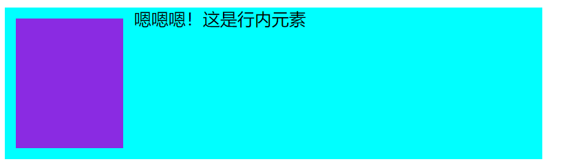

## 前言

本篇文章是看过[《css系列-css深入理解之float浮动》](https://segmentfault.com/a/1190000014554601) 之后的一些感悟和思考。原文章已经写过的知识，就不再赘述了。

## 一、 从“左中右”布局说起

从上面链接中一个小布局说起，实现这个布局

- **文字环绕变身**-中间内容居中，左中右布局

源代码是这么写的

html中：

```
<div class="content">
        <a href="#" class="fl">左青龙</a>
        <a href="#" class="fr">右白虎</a>
        <h3 class="text-center">标题</h3>
</div>
```

CSS中：

```
	  .fl {
            float: left;
        }
        
      .fr {
            float: right;
        }
        .text-center {
            text-align: center;
        }
```

效果如图：


不知道你有没有这个疑问，为什么前面的布局要先把两个浮动元素放在最前面呢？

一旦我们将几个元素的顺序调换了位置，就会发现这些布局发生意想不到的变化。

```
<div class="content">
        <a href="#" class="fl">左青龙</a>
        <h3 class="text-center">标题</h3>
        <a href="#" class="fr">右白虎</a>
</div>
```

我们发现效果是这样的


## 二、浮动元素其实是真的“浮动”

为什么会这么说呢？我们可以这样理解，将一个元素设置元素之后，就发生了两件事情，

1. 在它的原来的位置向上**“漂浮”**

2. 去除原来文档流中的位置。

   

   可以大致分为三种情况（本质都是一样的）

#### 1. 都是浮动元素

html中

```
<div class="test1">
        <div class="float"></div>
        <div class="float"></div>
        <div class="float"></div>
    </div>
```

css中

```
        .test1 {
            width: 500px;
            background-color: aqua;
            overflow: hidden;/*触发BFC*/
            margin: 10px;
        }
        .float {
            width: 100px;
            height: 100px;
            background-color: blueviolet;
            margin: 10px;
        }
```


增加`float: left`之后


我们来分析一下发生了什么？

**在未进行浮动是这样的**


紧接着第一个block 浮动，它首先向上浮动，然后清除原来的位置。导致下面的block向上占据了原来的位置。


同样的道理


#### 2. 有未浮动的块级元素

html

```
    <div class="test2">
        <div class="float"></div>
        <div class="block"></div>
        <div class="float"></div>
    </div>
```

```
        .test2 {
            width: 500px;
            background-color: aqua;
            overflow: hidden;
            margin: 10px;
        }

        .float {
            width: 100px;
            height: 100px;
            background-color: blueviolet;
            margin: 10px;
        }
        .block {
            width: 100px;
            height: 100px;
            background-color: green;
            margin: 10px;
        }
```

初始效果相同。

将两个进行浮动`float:left`

效果如图


并不因为缺了一个block ，只是被覆盖了。

#### 3 行内元素

```

    <div class="test3">
        <div class="float"></div>
        <span class="inline">嗯嗯嗯！这是行内元素</span>
        <div class="float">
        </div>
    </div>
```

```
       .test3 {
            width: 500px;
            background-color: aqua;
            overflow: hidden;
            margin: 10px;
        }
        .float {
            width: 100px;
            height: 100px;
            background-color: blueviolet;
            margin: 10px;
        }

```


将第一个向左浮动。



为了看清楚，将第二个block的宽度改为200px


最终效果：

## 三、float的破坏性

float会破坏块级元素的流式性。所谓流式性，就是当块级元素没有设置宽度的时候，他会自动的设置成和父元素相同的宽度！而当元素一旦设置成了float之后，会破坏这种特性，从而必须设定一个宽度，将元素撑起来。

所以你会看到，一般设置float的元素，都会紧跟着宽度。

（完）