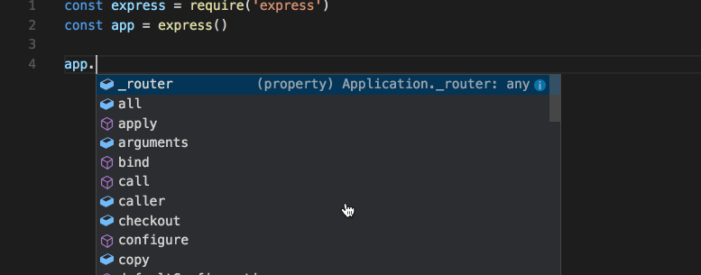
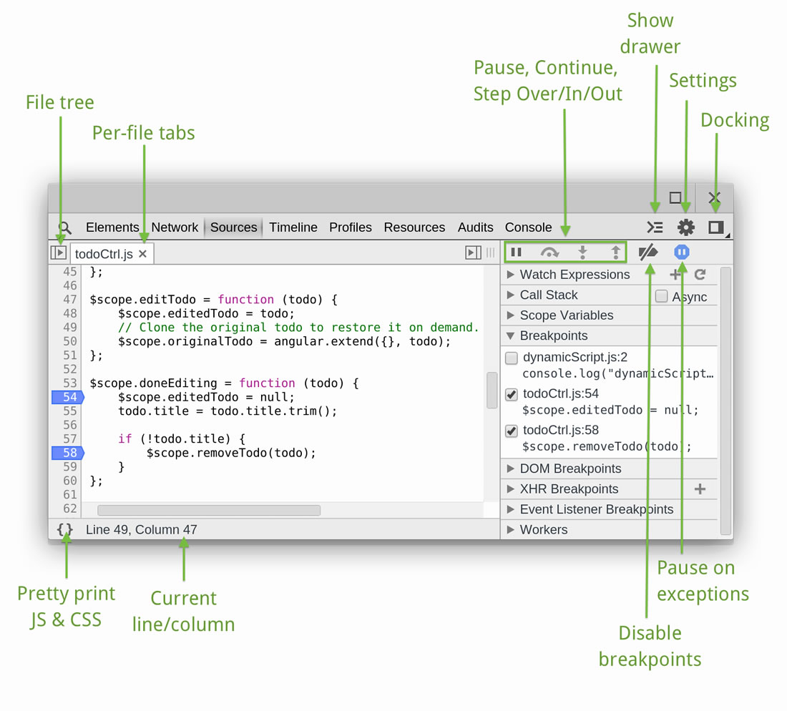

如果你之前没有了解过JavaScript，那么需要进行一些补充

在了解之前，我们需要捡一些屎。

## Javascript的捡屎

1. Netscape我们叫他网基公司，它有一个浏览器NN浏览器（Netscape Navigator)
2. NN快要发布到2代的时候，网基觉得自己牛逼了，所以想要解决表单验证的烦恼。
3. 网基就加班加点开始开发这个脚本语言
4. 在命名的时候，为了蹭一下Java的热度，于是改名成了JavaScript。
5. 这个热度蹭的可太好了，很成功，很火，微软老大哥一看，这不行啊，老子的IE浏览器不能输！IE就抄了一手，为了版权的问题，那就改名字吧，就叫Jscript
6. 两家发展越来越壮大，web越来越重要，两家的Javascript版本也会越来越分歧，so某某协会开始了标准化，这个标准就叫做ECMAScript。

#### ECMAScript

1. 由你所见，他作为标准，并不规定运行环境，只是规定了语法，类型，语句，关键字，保留字，操作符，对象。
2. 目前已经到第八个版本，ES8（简写），但是本书写到了ECS5，，，，长路漫漫。。。。

关于版本的更新问题，有人做了一张图。

图片有些看不清了可能，可以狠狠的点击这个[关于ECMAScript发展现状](https://www.css88.com/archives/9925)     [ECMAScript维基百科](https://www.css88.com/archives/9925)

包括了两个问题现在已经到了ES9,18年6月份发布的。哈哈哈 发展的太快了吧。ES5还没学呢。有些忧伤。

Javascript的屎就捡到这里了。

## 关于一些自学的资料

首先最粗暴的就是官方文档了。所谓前人栽树，后人乘凉，所以我倒觉得在手头有中文版的还是去看中文版的吧。毕竟我的英文水平也不是很高。看多了也头疼。

[ES5中文版](http://yanhaijing.com/es5/#null)

在这个文章里面也有很多类似的文章。

- <http://www.ecmascript.org/>
- [w3c 中文版](https://www.w3.org/html/ig/zh/wiki/ES5)
- [ECMAScript 5.1 pdf（英）](http://yanhaijing.com/es5/Ecma-262.pdf)
- [ecma-international ecma 262 5.1（英）](http://www.ecma-international.org/ecma-262/5.1/index.html)
- [Mozilla es5.1（英）](https://people.mozilla.org/~jorendorff/es5.1-final.html)
- [ECMAScript 3 中文版 pdf](http://yanhaijing.com/es5/ECMAScript%E8%A7%84%E8%8C%83-%E7%AC%AC%E4%B8%89%E7%89%88_%E4%B8%AD%E6%96%87%E7%89%88.pdf)
- [ECMAScript 6 入门(阮一峰)](http://es6.ruanyifeng.com/)
- [ECMAScript® 2015 Language Specification（ES6英）](http://www.ecma-international.org/ecma-262/6.0/)
- [ECMAScript® 2016 Language Specification（ES7英）](http://www.ecma-international.org/ecma-262/7.0/index.html)
- [ECMAScript® 2017 Language Specification（ES8英）](http://www.ecma-international.org/ecma-262/8.0/index.html)

## 开始编写JavaScript代码

怎么编写JavaScript代码呢？其实用任何编辑器都可以。

- Visual Studio code 

  微软出品。内置JavaScript，可以使用。推荐。

- Sublime Text

  好用的文本编辑器。

- Notepad++

  同上。

## 如何使用Visual Studio Code 编写Javascript？

#### 1. 下载安装

[点击，选择自己对应的版本进行下载](https://code.visualstudio.com/Download)

一直下一步就好啦！

#### 2. 了解 VS Code

[这是官方文档](https://code.visualstudio.com/docs)

将一些重点翻译一下哈。

**开始**

VScode 是一个轻量级但功能强大的源代码编辑器，他能够在Windows，mac，Linux系统上运行。

它提供了内置Javascript TypeScript和 Node.js的支持；针对其他语言（如C++，C#,Java,Python,PHP,GO)和运行时（如.NET ，Unity)拥有丰富的可扩展生态系统,开始你的旅途吧 ，点击这里观看[引导视频](https://code.visualstudio.com/docs/getstarted/introvideos)。

VScode 有以下的功能：

- 智能代码补全

  代码补全，Visual Studio Code IntelliSense is provided for JavaScript, TypeScript, JSON, HTML, CSS, SCSS, and Less out of the box. 其他语言需要下载扩展使用，使用`tap` 或者`Enter`会自动插入所选

  

  可以在任何编辑器窗口使用`ctrl+space` 或者 `.`来触发智能感知。在实际上我进行`ctrl+space`的时候，却什么都没有发生，因为和windows键冲突了，所以更改一下！**更改方法**：文件-首选项-键盘快捷方式 把`ctrl+space`修改为别的如：`alt+/` 使用`ctrl+space`或点击后面的帮助图标，可以查看方法。再次点击或 输入`ctrl+space`关闭方法。

- 流线型调试工具，Print 调试已是过去时，在VSCode 使用你的终端工具进行调试。

- 更快 更强大的编辑。

- 智能纠错（原文为linting，类似于word 的拼写检查）多光标编辑，参数提示，和其他强大的编辑特点。

- 代码导航和重构

  使用Peek和navigate todefinition 快速浏览源代码。

- 项目源控制

  使用内置在编辑器里的的SCM（包含丰富的GIT集成），从而加快发布周期。

**第一步**

为了完全明白VSCode,开始回顾一些引导话题

[Intro Videos](https://code.visualstudio.com/docs/getstarted/introvideos) - Begin your journey with VS Code through these introductory videos.

[Setup](https://code.visualstudio.com/docs/setup/setup-overview) - Install VS Code for your platform and configure the tool set for your development needs.

[User Interface](https://code.visualstudio.com/docs/getstarted/userinterface) - Introduction to the basic UI, commands, and features of the VS Code editor.

[Settings](https://code.visualstudio.com/docs/getstarted/settings) - Customize VS Code for how you like to work.

[Languages](https://code.visualstudio.com/docs/languages/overview) - Learn about VS Code's support for your favorite programming languages.

[Node.js](https://code.visualstudio.com/docs/nodejs/nodejs-tutorial) - This tutorial gets you quickly running and debugging a Node.js web app.

[Tips and Tricks](https://code.visualstudio.com/docs/getstarted/tips-and-tricks) - Jump right in with Tips and Tricks to become a VS Code power user.

[Azure](https://code.visualstudio.com/docs/azure/extensions) - VS Code is great for deploying your web applications to the cloud.

[Extension API](https://code.visualstudio.com/api) - Learn how to write a VS Code extension.

[Why VS Code?](https://code.visualstudio.com/docs/editor/whyvscode) - Read about the design philosophy and architecture of VS Code.

**键盘快捷键**

Increase your productivity with VS Code's keyboard shortcuts.

[Keyboard Shortcut Reference Sheet](https://code.visualstudio.com/docs/getstarted/keybindings#_keyboard-shortcuts-reference) - Learn the commonly used keyboard shortcuts.

[Keymap Extensions](https://code.visualstudio.com/docs/getstarted/keybindings#_keymap-extensions) - Change VS Code's keyboard shortcuts to match another editor.

[Customize Keyboard Shortcuts](https://code.visualstudio.com/docs/getstarted/keybindings#_customizing-shortcuts) - Modify the default keyboard shortcuts.

**扩展**[#](https://code.visualstudio.com/docs/setup/setup-overview#_extensions)

VS Code [扩展](https://code.visualstudio.com/docs/editor/extension-gallery)能够让第三方提供额外的支持：

- 语言 - [C++](https://code.visualstudio.com/docs/languages/cpp), [C#](https://code.visualstudio.com/docs/languages/csharp), [Go](https://code.visualstudio.com/docs/languages/go), [Java](https://code.visualstudio.com/docs/languages/java), [Python](https://code.visualstudio.com/docs/languages/python)
- 工具 - [ESLint](https://marketplace.visualstudio.com/items/dbaeumer.vscode-eslint), [JSHint](https://marketplace.visualstudio.com/items/dbaeumer.jshint) , [PowerShell](https://marketplace.visualstudio.com/items?itemName=ms-vscode.PowerShell)
- 调试器 - [Chrome](https://marketplace.visualstudio.com/items?itemName=msjsdiag.debugger-for-chrome), [PHP XDebug](https://marketplace.visualstudio.com/items?itemName=felixfbecker.php-debug).
- 关键词映射（Keymaps） - [Vim](https://marketplace.visualstudio.com/items?itemName=vscodevim.vim), [Sublime Text](https://marketplace.visualstudio.com/items?itemName=ms-vscode.sublime-keybindings), [IntelliJ](https://marketplace.visualstudio.com/items?itemName=k--kato.intellij-idea-keybindings), [Emacs](https://marketplace.visualstudio.com/items?itemName=hiro-sun.vscode-emacs), [Atom](https://marketplace.visualstudio.com/items?itemName=ms-vscode.atom-keybindings), [Visual Studio](https://marketplace.visualstudio.com/items?itemName=ms-vscode.vs-keybindings), [Eclipse](https://marketplace.visualstudio.com/items?itemName=alphabotsec.vscode-eclipse-keybindings)

扩展和 VS Code的 UI、命令行以及任务运行系统融为一体,所以通过VS Code 分享的接口，你可很容易地用不同的技术进行工作。 在这里查找你需要的扩展 [Marketplace](https://marketplace.visualstudio.com/vscode) 

**下一步**

一旦你安装并且初始化了VS code，下面的步骤会更加让你了解VS Code：

- [Additional Components](https://code.visualstudio.com/docs/setup/additional-components) - Learn how to install Git, Node.js, TypeScript and tools like Yeoman.
- [User Interface](https://code.visualstudio.com/docs/getstarted/userinterface) - A quick orientation to VS Code.
- [Basic Editing](https://code.visualstudio.com/docs/editor/codebasics) - Learn about the powerful VS Code editor.
- [Code Navigation](https://code.visualstudio.com/docs/editor/editingevolved) - Move quickly through your source code.
- [Debugging](https://code.visualstudio.com/docs/editor/debugging) - Debug your source code directly in the VS Code editor.
- [Proxy Server Support](https://code.visualstudio.com/docs/setup/network) - Configure your proxy settings.

If you'd like to get something running quickly, try the [Node.js tutorial](https://code.visualstudio.com/docs/nodejs/nodejs-tutorial) walkthrough which will have you debugging a Node.js web application with VS Code in minutes

下载好的VS code 就像一个壳子一样，虽然能用，但是我们还是需要更加完善的功能来提高我们的效率。这就需要下载插件。

**常见快捷键**

这个慢慢补充~

- [Keyboard Shortcuts Reference](https://code.visualstudio.com/docs/getstarted/keybindings#_keyboard-shortcuts-reference) - Learn the most commonly used and popular keyboard shortcuts by downloading the reference sheet.
- [Install a Keymap extension](https://code.visualstudio.com/docs/getstarted/keybindings#_keymap-extensions) - Use the keyboard shortcuts of your old editor (such as Sublime Text, Atom, and Vim) in VS Code by installing a Keymap extension.
- [Customize Keyboard Shortcuts](https://code.visualstudio.com/docs/getstarted/keybindings#_customizing-shortcuts) - Change the default keyboard shortcuts to fit your style.

多行光标选择：

格式文档快捷键`shift+alt+F`格式当前整个文件

格式已选择文本`ctrl+k``ctrl+F` 格式已选择文本。

**代码导航**

**快速文件导航**

VScode 通过简单易用的按键绑定，提供了两个强大的命令去导航整个文件。按住`ctrl`按`tab`去观看再一个编辑器组中打开的一系列文件。使用`tab`键可以去挑选你想要去的文件，松开`ctrl`即可打开。

你还可以使用`Alt+left`和`Alt+right`左右翻页。

如果你知道文件的名字，可以使用`ctrl+p`进行查询。

**去定义**

如果一个语言支持，你可以通过按`F12`来直接进入到相关符号的定义。如果你按住`ctrl`并且再一个标注悬浮，你将会预览声明：

**Debugging**

Vscode 一个重要的特色就是它能够提供优秀的debugging 支持。VS Code 内置的Debugger （调试器)能够帮助加速你的编辑，编译以及调试循环。

**Debugger 拓展**

VScode拥有内置的调试，需要Node.js的环境支持，能够进行调试Javascript，TypeScript，和其他任何能够转换到Javascript语言的语言。

这里面有一个插件，可以使用就是Debugger for chrome --Debug your JavaScript code running in Google Chrome from VS Code.

**开始debugging**

以下基于遇内置Node.js的编译器，但是大部分的理念和特点也都适用于其他的的编译器。

在阅读之前，创建一个简单的Node.js应用是非常有帮助的。

未完待续。。。

**1. 什么是Node.js?**

Node.js在[服务器](https://zh.wikipedia.org/wiki/%E4%BC%BA%E6%9C%8D%E5%99%A8)端运行[JavaScript](https://zh.wikipedia.org/wiki/JavaScript)的[开放源代码](https://zh.wikipedia.org/wiki/%E9%96%8B%E6%94%BE%E5%8E%9F%E5%A7%8B%E7%A2%BC)、[跨平台](https://zh.wikipedia.org/wiki/%E8%B7%A8%E5%B9%B3%E5%8F%B0)JavaScript [运行环境](https://zh.wikipedia.org/wiki/%E6%89%A7%E8%A1%8C%E7%8E%AF%E5%A2%83)。Node.js采用[Google](https://zh.wikipedia.org/wiki/Google)开发的[V8](https://zh.wikipedia.org/wiki/V8_(JavaScript%E5%BC%95%E6%93%8E))运行代码，使用[事件驱动](https://zh.wikipedia.org/wiki/%E4%BA%8B%E4%BB%B6%E9%A9%85%E5%8B%95)、[非阻塞](https://zh.wikipedia.org/w/index.php?title=%E9%9D%9E%E9%98%BB%E5%A1%9E&action=edit&redlink=1)和 [异步输入输出](https://zh.wikipedia.org/w/index.php?title=%E9%9D%9E%E5%90%8C%E6%AD%A5%E8%BC%B8%E5%85%A5%E8%BC%B8%E5%87%BA&action=edit&redlink=1)模型等技术来提高性能，可优化应用程序的传输量和规模。

**2. 为什么安装Node.js**

按道理讲Node.js是要在服务器端安装的，是不是，但是呢我们在本地进行开发，还是需要安装Node.js的~现在我们需要更好的运行我们的Js文件，如果只能在浏览器中运行，那就太麻烦了，所以如果我们想在VSCode 更方便的使用JS的话，就需要安装Js的运行环境（Node.js）

**3. 开始安装Node.js**

下载安装包，然后next-next...

cmd，然后输入`node --version`出现版本号就证明安装成功了。

**4. 进行一个Node.js书写**

未完待续。。。

#### 3. 前端开发需要哪些扩展？

**1. code runner**

可以安装后直接运行在node 环境中，然后在vscode中输出文件的结果。

在js文件里面右键选择Run Code或者编辑器右上角的方形运行按钮来运行文件，结果在输出一栏输出。

【注意】在我进行实验的时候，发现输出会出现乱码的情况。阅读文档发现。

使用编辑器打开setting.json 或者点击**文件->首选项->设置**，可以打开设置面板。打开code-runner .executorMap设置讲JavScritpt改为node的路径。注意要用`\\`双斜杠,同时路径要写到 `node.exe`为止。目前能够正常运行js代码啦。

**2. HTML Snippets**

**3. HTML CSS support**

**4. Debugger for Chrome**

**5. JQuery Code Snipeets**

**6. VScode-icon**

**7. Path Intellisense**

详见这篇文章[VSCode插件推荐-献给所有前端工程师](https://segmentfault.com/a/1190000006697219)

#### 4. 调试JavaScript脚本（了解chrome）

[我学习的时候是按照这篇文章走的，并做部分修改，进行总结！](http://wiki.jikexueyuan.com/project/chrome-devtools/debugging-javascript.html)

我们使用Chrome DevTools 提供的一系列工具来进行调试Javascript。

##### 认识面板

随便打开一个站点，按F12,就可以打开DevTools窗口，进行调试代码。

点开source 可以看到文件树（File tree），详细面板如下

File tree （文件树）Per-file tabs（每个文件标签）show drawer（显示console界面）settings（设置）Docking（就是设置面板在哪一侧显示）

##### 执行控制

执行控制相关的按钮就在侧面板的顶端，他们使得你能够单步执行代码。以下为详细的解释。

- **Continue**：继续执行代码，直至遇到另一个断点。

- **Step over（逐步执行）**：逐行执行，以了解每一行如何操作当前的变量。当你的代码调用另一个函数的时候，调试器不会跳到那个函数的代码中去，其焦点还是当前的函数，而 Step into 则相反。

- **Step into（进入执行）**：和逐步执行类似，但是点击step into会在函数调用时,令调试器将执行转到所调用的函数声明中去。

- **Step out**：当使用step into进入某个函数内部后，点击该按钮会跳过该函数声明的剩余部分，调试器会将执行过程移动到其父函数中。

- **Toggle breakpoints**：切换断点启用、禁用状态，同时保证各自的启用状态不会受到影响。

  在源面板中，有许多相关的快捷键可用：

  - Continue：在Mac上使用 `F8` 或者 `Command` + `\`，其他平台上为 `Ctrl`+ `\`。
  - Step over：在Mac上为 `F10` 或者 `Command` + `'`，在其他平台上为 `Ctrl` + `'`。
  - Step into：在Mac上为 `F11` 或者 `Command` + `;`，在其他平台上为 `Ctrl` + `;`。
  - Step out：在Mac上为 `Shift` + `F11` 或者 `Shift` + `Command` + `;`，在其他平台上为 `Shift`+ `Ctrl` + `;`。
  - Next call frame：`Ctrl` + `.`。（适用于全平台）
  - Previous call frame： `Ctrl` + `,`。（适用于全平台）

## 总结

哈哈哈哈 到此为止，我们终于把VSCode ,这个工具搞的有些懂了，能够真正的进入JS的学习啦~加油~

排版有些乱，请见谅，有时间再好好的修改一下吧。

## 修改记录

2019.1.9 修改无图的问题

​		增加chrome DevTools的使用。

