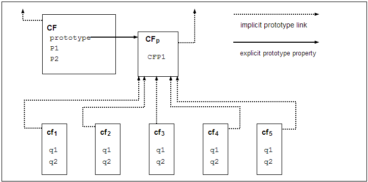
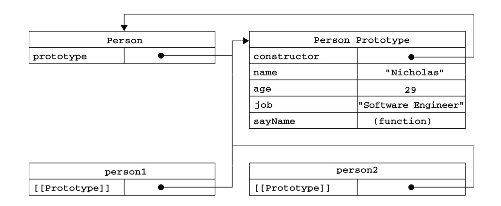
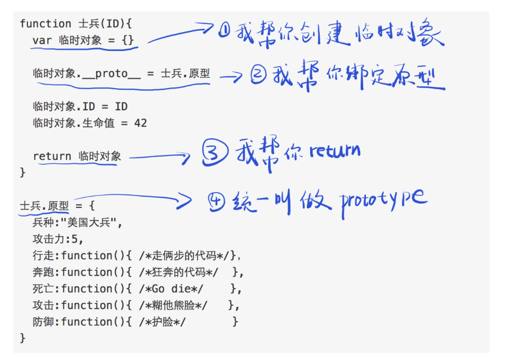
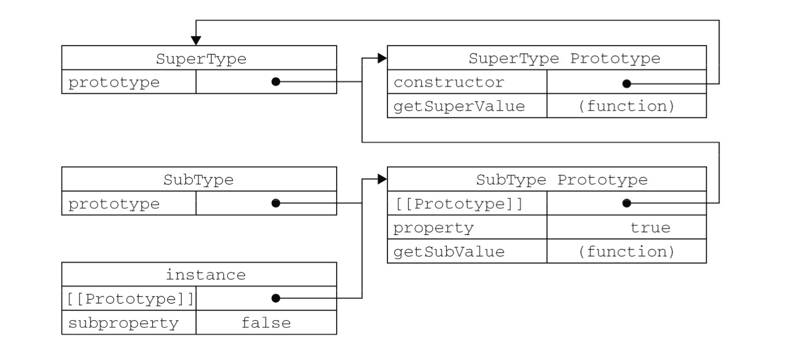
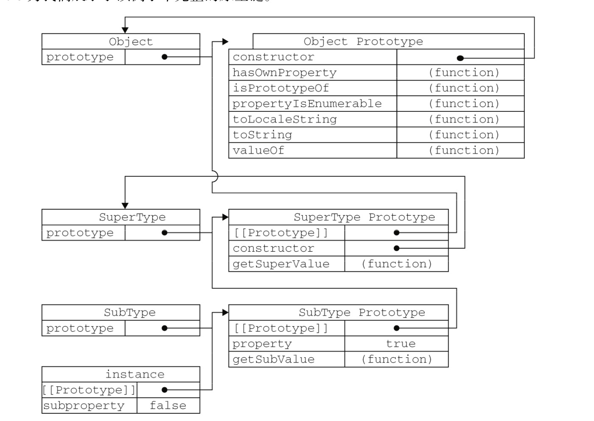

## 何为引用数据类型

引用数据类型是一个数据结构，将数据和工能组织在一起，在其他的语言中，我们可以称之为**类**，类只是一个笼统的概念，如果将其具体化，就是对象（Object），比如说我们现在创建一个人的类，这里面的概念比较笼统，里面只是，名字、身高 和 体重 以及一些说话的技能的集合，然而我们现在创建一个叫做Mike的对象，这样就将类具体化了！然而JavaScript中的引用类型和**类**并不是完全相同。

ECMA-262 把对象定义为： **”无序属性的集合，其属性可以包含基本值、对象或者函数“**。我们可以把它想象成一组名值对的集合。

而这个对象对于ECMAScript，真的是无处不在，ECMAScript就像一个寄生虫一样，他必须放在一个宿主环境里面，吸收相应的养分，才能够进行生存。

**放在web浏览器中**，就提供了ECMAScript的宿主环境，给寄生虫提供了很多的养料（对象）可供食用（使用），web浏览器提供了对象有：windows，menus等等等。

**放在web服务器中**，则养料完全不一样，有requests，clients，files以及数据锁定和分享的机制。

而对象（objects）则是属性（properties）的集合。和其他语言不同的是，这里面的属性下面又有零个或多个特性（attributes)。而这个环境就是所谓的Node.js

## 理解JavaScirpt对象

**可以先往下看，看到不懂为止，然后再返回这里加深理解。**

JavaScript的对象和其他语言的对象，不太一样。

#### 1. 原型

**[以下引用官方文档，结合自己的理解，做部分修改]**

**Javascript高级程序设计**

##### 1）原型和原型对象

要想理解什么是原型，那就需要先知道什么是**原型**和**原型对象**。

**原型（prototype)**

不用试图理解原型的这一概念，我们需要知道的是**每个函数都有一个名为"prototype"的属性。**。构造函数也不例外，这个属性就是一个指针，指向一个对象，而这个对象就是**原型对象**。

**原型对象**

原型对象其实就是原型的对象，基于这个原型而产生的一个对象。



如图所示，CF这里面代表的是，构造器，而下面的cf1，cf2，cf3，cf4，cf5则是由构造器new出来的五个对象，会发现每个由构造器创建的对象，都有一个隐式引用（这里面说的隐式是因为在脚本中，没有标准的方式访问这个，但Firefox、Safari和Chrome在每个对象上都支持一个属性\___proto_\__;而在其他实现中，是完全不可见的。）链接到构造器的"prototype"属性值。CFp就是原型对象，**起到了共享属性和实现继承的作用**

以我们之前写过代码为例子，以下这张图能够清晰的表示出来。

我们可以推理出来，我们可以给原型对象中添加新的属性值来为 对象们添加一个共享属性。

我们可以通过Person.prototype访问到这个原型对象。这么一想的话，这个原型对象，真的就是person1和person2的“原型“啊！

原型和原型对象我们知道了，接下来是函数的一些知识。

**每创建一个函数，就会通吃创建它的prototype对象，这个对象也会自动的获得constructor属性，这个constructor属性又指向了Person** 相当于跑来跑去，又成了一个圈。


#### 1. 属性的特征

比如：我们现在创建这样一个对象

```
var person = {
    name : "Nicholas",
    age : 29,
    job : "Software Engineer",
    
    sayName: function() {
		alert(this.name);
	}
};
```

在一个个属性中，还有相应的特性(attribute)来进行规定他们的行为。【注意】这些是个给JavaScript引擎用的，在JavaScript种，不能直接访问他们。


##### 数据属性

有四个特征。

[[Configurable]]:能否通过delete删除属性从而重新定义属性，能够修改

而ES5，有一个新方法，就是definePro

未完待续。。。

## 关于new操作符

忽然想到new这个操作符到底是干什么呢，于是查找资料，发现一篇文章写的还蛮有意思的。

[JS 的 new 到底是干什么的？](https://zhuanlan.zhihu.com/p/23987456)

我们直接把结论摆出来

使用new 操作符，实际上简化了很多操作。

1. 不用创建临时对象，（使用this 可以访问到临时对象）
2. 不用绑定原型。
3. 不用return临时对象，new会帮你做。
4. 不用给原型想名字了，原型为prototype

借用原作者的一张图说明。



## 创建对象的方式

[Javascript高级程序设计](#)

#### 1. Object构造函数

```
var person = new Object();
```

通过new这个操作符，后面加一个Object()的构造函数来进行创建，构造函数归根结底，是一个函数，只不过它函数的功能是进行**创建对象。**上面的代码就是创建了一个Object的对象。

```
var person = new Object();
person.name = "Nicholas";
person.age = 29;
```

这样就可以创建完成了。


#### 2.  对象字面量

第一次听到字面量我是蒙蔽的，这说的是啥东西，可以这样理解，字面是从表面上理解。


在这里面就是说，这个变量从表面上来就非常清晰明显了。这个就叫做字面量。接着看例子就懂了!

现在我们使用对象字面量来进行刚才对象的创建。

```
var person = {
    name : "Nicholas",
    age : 20
};
```

同时，如果一个代码这样写

```
var person = {};
```

这个就和`new Object()`是相同的。

在后面的一些知识里，我们可以知道，还需要注意的是：

**一旦用字面量进行重写了之后，就会切断，对象与原型之间的联系。**

---

但是说到底，JavaScript是没有类的概念的，但是类的概念又是如此的重要啊，有了类，我们就能够创建大量的相似对象，但是如果我们使用上述代码，用Object()来创建对象，我们每创建一个对象，就需要向里面一遍一遍的添加属性 添加属性

````javascript
var person1 = new Object();
person1.name = "sb1"; 
person1.age= 29;
var person2 = new Object();
person1.name = "sb2"; 
person1.age= 29；`
````

同理，用对象字面量来进行创建，也要很多行代码，这多麻烦呀！一点都不符合类的概念，急需要一种方法来解决这一问题。

#### 3. 工厂模式

正如其名，意思就是工厂里加工产品一样，这个工厂，只要有一个模子，就可以复制出无数个产品。

这个工厂就是需要用函数包裹起来，在里面创建一个模子，代码如下：

```
function createPerson(name,age,job) {
    var o = new Object();
    o.name = age;
    o.age = age;
    o.job = job;
    o.sayName = function() {
        alert(this.name);
    };
    return o;
}

var person1 = createPerson("sb1",20,"捡垃圾");
var person2 = createPerson("sb2",20,"捡垃圾2");

```

这就创建了两个捡垃圾的小伙子。虽然工厂模式解决了创建多个相似对象的问题，但是我们没有办法向其他“类”语言一样（拥有类概念的语言）知道这个变量是哪一个类型，全部都是Object类型！这很不好！

```
console.log(person1 instanceof Object);//true
console.log(person1 instanceof createPerson);//false
```

#### 4. 构造函数模式

读到这里可以返回观看。

除了使用Object()这种原生的构造函数以外，还可以创建自定义的构造函数，这个就很符合类的概念了！

```
function Person(name,age,job){
    this.age = age;
    this.name = name;
    this.job = job;
    this.sayName = function() {
        alert(this.name);
    };
}

var person1 = new Person("sb1",20,"捡垃圾");
var person2 = new Person("sb2",29,"烤面筋");
console.log(person1.job);//捡垃圾
// console.log(person2.sayName());
console.log(person1 instanceof Person);//true
console.log(person1 instanceof Object);//true
console.log(person1 instanceof Array);//false
```

在这个例子中，Person()函数取代了createPerson()函数，在这里面**没有显式的创建对象，而是使用new操作符调用构造函数创建的。**


如前面所说的，其实person1 和 person2都是Person的实例，他们两个都有一个constructor属性并且指向了Person。

构造函数创建对象的方式，成功的解决了类型的问题，能够将他标识为一种特定的类型。

但是又有新的问题出现了，使用构造函数创建对象，会发现，每个方法都要在每个实例上面重新创建一遍。而他们的功能都是一样的！下面代码可以说明

```
alert(person1.sayName==person2.sayName;//false
```

创建两个同样的函数实在没有必要，我们需要用到原型模式。

> **构造函数也是一种函数**

构造器要通过new表达式来创建对象，如果不使用new的话，则需要看构造器本身了，比如：直接调用`Date()`将产生当前日期时间的字符串，而不是一个对象。

```
console.log(Date());
console.log(typeof(Date()));
console.log(new Date());
console.log(typeof(new Date()));
```

输出

```
Tue Jan 08 2019 22:26:19 GMT+0800 (GMT+08:00)
string
2019-01-08T14:26:19.758Z
object
```

由此可以看出区别。

【注】当全局作用于中调用一个函数时，this对象总是指向Global对象（再浏览器中就是window对象）。

```
//当作构造函数使用
var person = new Person("Nicholas",29,"Software Engineer");
person.sayName();//"Nicholas"
//作为普通函数调用
Person("Greg",29,"Doctor");//添加到window
window.sayName();//"Greg"
//在另一个对象的作用域中调用
var o = new Object();
Person.call(o,"Kristen",20,"Nurse");
o.sayName();//"Kristen"
```

#### 5. 原型模式

从上面可以了解到原型模式了，所以我们可以这样创建构造函数。

```
function Person() {

}
Person.prototype.name = "sb1";
Person.prototype.age = 29;
Person.prototype.job = "捡垃圾";
Person.prototype.sayName = function () {
    alert(this.name);
};

var person1 = new Person();//可以创建一个对象啦！
```

上面这种创建的也很麻烦，有一种简单的方式。

```
function Person() {

}
//将上面的一大堆，转换为了对象字面量来进行创建。
Person.prototype = {
    name: "sb1",
    age: 29,
    job: "捡垃圾"
};

var person1 = new Person();//可以创建一个对象啦！
```

注意上面的这种写法，和第一种还是有区别的，第二种创建方式，相当于重新创建了一个新对象，第二个对象的constructor属性不再指向Person了。我们之前说过，每创建一个函数，就会随之创建一个prototype属性，这个属性将引用原型对象，这个原型对象有一个constructor 又引到了 这个函数。

如果这个constructor的值真的非常重要，那么可以显式的去给出。

```
function Person() {

}
//将上面的一大堆，转换为了对象字面量来进行创建。
Person.prototype = {
    name: "sb1",
    age: 29,
    job: "捡垃圾",
    sayName: function(){
        console.log("my name is " + this.name)
    }
};

var person1 = new Person();//可以创建一个对象啦！
person1.sayName();//my name is sb1

```

这样后加入的代码，虽然解决了，但是并不是原生的嘛，所以还是有区别滴，也就是这个后加进去的constructor的[[Enumerable]]是true，而默认的是false。原生的是不可枚举的。

但是如果我们先进行了实例的创建。。。

```
function Person() {

}
var person1 = new Person();

Person.prototype = {
    name: "sb1",
    age: 29,
    job: "捡垃圾",
    sayName: function(){
        console.log("my name is " + this.name)
    }
};


person1.sayName();//error

```

就会错误！重写了之后就相当于重新创建了一个原型对象！真的是一个大坑！

用原型模式进行创建，也有缺点，

1. 他省略了为构造函数传递参数的过程，导致每次创建对象都是一样的，属性值也是相同的。
2. 同样的如果属性中有引用类型的话，就比较严重了，试想一下，两个对象的原型都指向同一个对象，当修改一个的属性，另一个也会变化！

所以很少有人单独使用原型模式的原因。

#### 6. 组合使用构造函数和原型模式

将一些共享的属性放在原型对象中，而其他自身的放在构造函数内部。

```
function Person(name,age,job) {
    this.name = name;
    this.age = age;
    this.job = job;

}

Person.prototype = {
    sayName: function(){
        console.log("my name is " + this.name)
    }
};


var person1 = new Person("sb1",29,"捡垃圾");
person1.sayName();//my name is sb1
console.log(person1.job);//捡垃圾

```

这种创建对象的方式认可度还是比较高的。

#### 7. 动态原型模式

所谓动态原型模式，就是动态的创建原型。如下代码：

```
function Person(name,age,job) {
    //属性
    this.name = name;
    this.age = age;
    this.job = job;
    //方法
    if (typeof this.sayName != "function") {
        Person.prototype.sayName = function() {
            console.log("my name is "+ this.name);
        }
    }
}


var person1 = new Person("sb1",29,"捡垃圾");
person1.sayName();//my name is sb1
console.log(person1.job);//捡垃圾


```

这个创建的就更加简单明了，更像是其他面向对象语言的类的概念了。当然在创建方法的时候，可以不必写一大堆if判断语句，可以只写一个，然后在后面创建了一大堆方法或属性。

#### 8. 寄生构造函数模式

前面几种方式都不适用的情况下， 可以适用寄生构造函数模式，基本思想就是创建了一个函数，该函数的通仅仅是封装创建对象的代码，然后再返回新创建的对象，而表面上看，又很像典型的构造函数。

```
//寄生模式创建对象
function Person(name,age,job) {
    var o = new Object();
    o.name = name;
    o.age = age;
    o.job = job;
    o.sayName = function () {
        console.log("my name is "+this.name);
    };
    return o;
}


var person1 = Person("sb1",29,"捡垃圾");
person1.sayName();//my name is sb1
console.log(person1.job);//捡垃圾
```

由前面可以知道，new操作符进行构造函数的调用的时候，会自动创建一个临时对象，并自动返回，但是，如果在构造函数的末尾添加一个return语句，就可以重写构造函数返回的值，所以以上就自动返回了o的对象。

**【注意】此时的对象和构造函数是没有什么关系，使用instanceof操作符对这种对象也没有意义。**

**适用条件:**


#### 9. 稳妥构造函数模式

稳妥对象适合在一些安全的环境中使用，因为他足够稳妥，稳妥构造函数准寻寄生构造函数类似的模式，但是有两点不同：

1. 新创建对象的实例方法不引用this
2. 不使用new 操作符调用构造函数。

重写代码如下：

```
//稳妥创建对象
function Person(name,age,job) {
    var o = new Object();
	//可以在这里定义私有变量和函数
    o.sayName = function () {
        console.log("my name is "+name);
    };
    return o;
}


var person1 = new Person("sb1",29,"捡垃圾");
person1.sayName();//my name is sb1
console.log(person1.name)//undefined

```

发现只能使用sayName()进行访问数据成员,所以可以理解为，如果此属性十分重要，可以不为此对象创建属性，而直接使用方法，并且不适用this，进行访问

**【注意】此时的对象和构造函数是没有什么关系，使用instanceof操作符对这种对象也没有意义。**

## 继承

有对象一定就有继承啦！在ECMAScript中通过原型链进行继承的。



可以发现只要将一个“子类”构造函数的原型对象的

```
//实现继承
function SuperType() {
    this.property = true;
}

SuperType.prototype.getSuperValue = function() {
    return this.property;
};

function SubType() {
    this.subproperty = false;
}

//继承了SuperType
SubType.prototype = new SuperType();
SubType.prototype.getSubproperty = function() {
    return this.subproperty;
};

var instance = new SubType();
console.log(instance.getSuperValue());//true

```

需要注意的是，因为我们重写了SubType的prototype，导致SubType的constructor引用为SuperType的构造函数。完整的继承关系如图所示。



#### 继承的几个问题

1. 由于通过new 父元素来实现继承的，所以父类上的属性，subType Prototype也会共享，导致创建的对象，都会共享相同的对象属性，这是很不好的。
2. 创建子类型实例的时候，不能像超类的构造函数中传递参数。

#### 解决办法

##### 1. 借调构造函数

在子类构造函数中，使用call()或apply()来进行创建对象。

```

function SuperType() {
    this.colors = ["black","yellow"];

}

function SubType() {
    SuperType.call(this);
}

var color1 = new SuperType();
color1.colors.push("red");
console.log(color1.colors);//[ 'black', 'yellow', 'red' ]

var color2 = new SubType();
console.log(color2.colors);//[ 'black', 'yellow' ]


```

我们把这种称为借调构造函数。它可以解决上面的两个问题，但是它本身并不是完美的，方法都在构造方法里面定义的，这样的话就会导致了之前的问题出现，所有的对象里面都一个方法的备份，这不仅没有必要，性能也会变得很低。

使用call 其实就是 将父类函数的代码运行了一遍，相当于：

```
this.colors = ["black","yellow"];
```

所以在自己的构造函数内部，生成了自己的属性，不受其他干扰。

##### 组合继承

将原型链和借调构造函数两种方法组合，取他们的长处，实现完美的继承。

技能实现函数（方法）的复用，也能保证每个实例都有他自己的属性。

```
function SuperType(name) {
    this.name = name;
    this.colors = ["red","blue","green"];
}
SuperType.prototype.sayName = function() {
    console.log(this.name);
};
function SubType(name,age) {
    SuperType.call(this,name);
    this.age = age;
}
//继承方法
SubType.prototype = new SuperType();
SubType.prototype.constructor = SubType;
SubType.prototype.sayAge = function() {
    console.log(this.age);
};

var person1 = new SuperType("小明");
person1.colors.push("black");
console.log(person1.colors);//[ 'red', 'blue', 'green', 'black' ]

person1.sayName();//小明
var person2 = new SubType("小李",29);
person2.sayName();//小李
person2.sayAge();//29
console.log(person2.colors);//[ 'red', 'blue', 'green' ]
```

##### 原型式继承

这种继承方式，并没有使用严格意义上的构造函数。

```
function object(o) {
    function F() {
        F.prototype = o;
        return new F();
    }
}
```

在objc

我们可以这样理解，先定义了一个原型，相当于共享的仓库，然后进行原型的绑定，之后的对象添加属性和方法，其实也并不会在这个共享仓库中体现，而是属于他们对象的自己的属性。

```
function object(o) {
    function F(){}
    F.prototype = o;
    return new F();
}
//先定义一个共享仓库（原型对象）
var person = {
    name: "吴亦凡",
    job: "捡垃圾",
    skill: "你看那个碗，它又大又圆...",
    friends: ["面筋哥","波澜哥"],
    freestyle: function() {
        console.log(this.skill);
    }
};
//创建对象
var person1 = object(person);
//改变person1的名字
person1.name = "雷总";
person1.skill = "Are you OK? hello Indian mi fans...";
//增加朋友
person1.friends.push("潇洒哥");
//在创建一个对象
var person2 = object(person);
//分别打印两个对象的数据
console.log(person1.name);//雷总
console.log(person1.job);//捡垃圾
person1.freestyle();//Are you OK? hello Indian mi fans...
console.log(person1.friends);//[ '面筋哥', '波澜哥', '潇洒哥' ]
console.log(person2.name);//吴亦凡
console.log(person2.job);//捡垃圾
person2.freestyle();//你看那个碗，它又大又圆...
console.log(person2.friends);//[ '面筋哥', '波澜哥', '潇洒哥' ]
console.log(person.name);//吴亦凡
console.log(person.job);//捡垃圾
person.freestyle();//你看那个碗，它又大又圆...
console.log(person.friends);//[ '面筋哥', '波澜哥', '潇洒哥' ]
```


当然如果那个属性是引用类型的话，那么在他身上的改动，就会影响整个对象。例如上面的friends数组。

ECMAScript5 新增了Object.create()方法规范了原型式继承。这个方法接受两个参数：新对象原型 的对象 和（可选的）一个为新对象定义额外属性的对象。也就是说我们不用再写object(o)函数了！

```

//先定义一个共享仓库（原型对象）
var person = {
    name: "吴亦凡",
    job: "捡垃圾",
    skill: "你看那个碗，它又大又圆...",
    friends: ["面筋哥","波澜哥"],
    freestyle: function() {
        console.log(this.skill);
    }
};
//创建对象
var person1 = Object.create(person);
//改变person1的名字
person1.name = "雷总";
person1.skill = "Are you OK? hello Indian mi fans...";
//增加朋友
person1.friends.push("潇洒哥");
//在创建一个对象
var person2 = Object.create(person);
//分别打印两个对象的数据
console.log(person1.name);//雷总
console.log(person1.job);//捡垃圾
person1.freestyle();//Are you OK? hello Indian mi fans...
console.log(person1.friends);//[ '面筋哥', '波澜哥', '潇洒哥' ]
console.log(person2.name);//吴亦凡
console.log(person2.job);//捡垃圾
person2.freestyle();//你看那个碗，它又大又圆...
console.log(person2.friends);//[ '面筋哥', '波澜哥', '潇洒哥' ]
console.log(person.name);//吴亦凡
console.log(person.job);//捡垃圾
person.freestyle();//你看那个碗，它又大又圆...
console.log(person.friends);//[ '面筋哥', '波澜哥', '潇洒哥' ]

```

第二参数可以如下使用

```
var anotherPerson = Object.create(person,{
    name: {
        value:"好好"
    }
});
```

当然这会覆盖掉原型对象的name值。


##### 寄生式继承

同样需要一个object()函数，进行原型的绑定，以实现继承。

```
 //创建继承
function object(o) {
    function F() {};
    F.prototype=o;
    return new F();
}


function createAnother(o){
    var clone = object(o);
    //为新建的属性进行
    clone.sayHi = function() {
        console.log("hi");
    };
    return clone;
}
//创建原型仓库
var person = {
    name:"吴亦凡",
    friends:["渣渣辉","古天乐"]
};

//以这个原型创建继承关系
var person1 = createAnother(person);
person1.sayHi();//hi
```

此种方法，可以看出 **不能够复用函数，导致效率降低。**


##### 寄生组合式继承 

回想一下之前的组合继承的例子。使用call或apply来进行属性值的复制，同时使用原型链来进行函数的共享。而所谓寄生组合式继承，则是通过借用构造函数来继承属性，通过原型链来继承方法。不必为子类型的原型而调用超类型的构造函数，我们需要的就是超类型的原型的副本而已。

本质上，使用寄生式继承来继承超类型的原型，然后再将结果指定给子类型的原型。

```
function inheritPrototype(subType,subType) {
    //创建对象
    var prototype = object(superType.prototype);
    //增强对象
    prototype.constructor = subType;
    //指定对象
    subType.prototype = prototype;
}
```

## 总结

未完待续，里面大多数是书上的知识，在学习完之后，还有一些懵懵懂懂，需要多多研读，这篇文章还是会不断更新的。